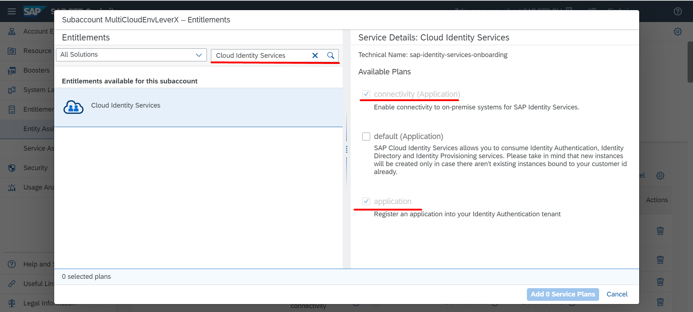

## Details

With this step you will get access to all required services including

- Cloud Identity Services
- SAP Build Work Zone, standard edition
- SAP Task Center

### Step 1: Add required Service Plans

1. Access your SAP BTP Global account
2. Go to Entity Assignments tab
3. Assign (if not assigned) required Entitlements

- Choose your Subaccount from Select Entities value help
- Click **Configure Entitlements** button

- Click **Add Service Plan** button
- Search for **Cloud Identity Services** service and select **connectivity (Application)** and **application** plans

- Search for **SAP Task Center** service and select **standard** plan
- Search for **SAP Build Work Zone, standard edition** service and select **free (Application)** plan

- Click **Add Service Plans** button
- Click **Save** button

As a result, you are entitled to use required services, so as of now it's possible to create Subscriptions and service Instances based on it

### Step 2: Create required Subscriptions

1. Go to your SAP BTP Subaccount
2. Go to Instances and Subscriptions tab
3. Create **SAP Build Work Zone, standard edition** subscription

- On Instances and Subscriptions page, click **Create** button
- Choose **SAP Build Work Zone, standard edition** from Service dropdown
- Choose **free** from Plan dropdown
- Click **Create** button

4. Create **Cloud Identity Services** subscription

- On Instances and Subscriptions page, click **Create** button
- Choose **Cloud Identity Services** from Service dropdown
- Choose **connectivity** from Plan dropdown
- Click **Create** button

As a result, as of now you can use both SAP Build Work Zone, standard edition and Cloud Identity Services Applications

### Step 3: Create required Instances

1. Go to Instances and Subscriptions tab
2. Create **Cloud Identity Services** service instance

- On Instances and Subscriptions page, click **Create** button
- Choose **Cloud Identity Services** from Service dropdown
- Choose **application** from Plan dropdown
- Choose your space from Space dropdown
- Specify meaningful Instance Name
- Click **Create** button

As a result, Cloud Identity Services service instance has been created

Proceed to the next step: [2 Set up and Configure SAP Task Center service](https://github.com/Sereg20/Task_Center/blob/master/BTP_config/2%20Set%20Up%20STC/README.md)
