## Details

With this step you will set up and configure SAP Task Center service


### Step 1: Create SAP Task Center service instance

1. Access you SAP BTP Subaccount

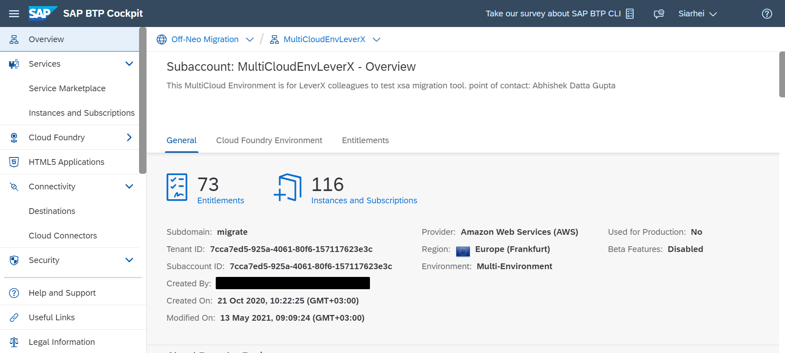

2. Create a service instance of the SAP Task Center service

- Go to Instances and subscriptions tab
- Click **Create** button

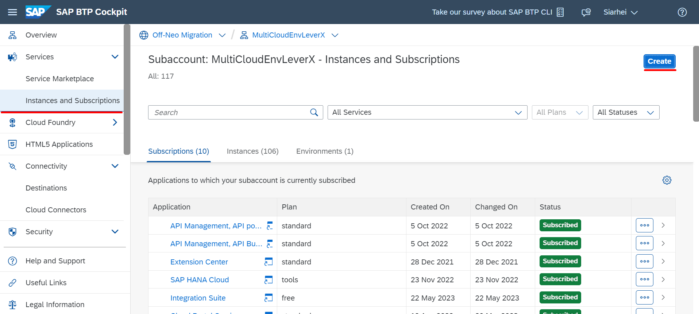

- Choose **SAP Task Center** from Service dropdown
- Choose your space from Space dropdown
- Specify meaningful Instance name
- Click **Next** button

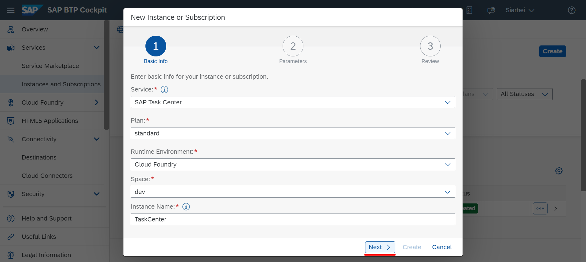

- Delete all instance parameters from the text area by clicking **Clear** button
- Click **Create** button

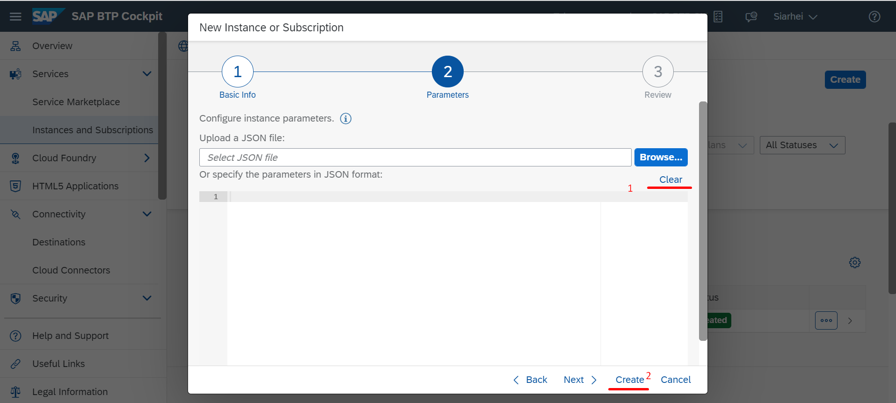

As a result, SAP Task Center service instance has been created and displayed in Instances table


### Step 2: Create a service key for the service instance

1. Select the newly created service instance
2. Create a service key

- On Service Keys tab, click **Create** button

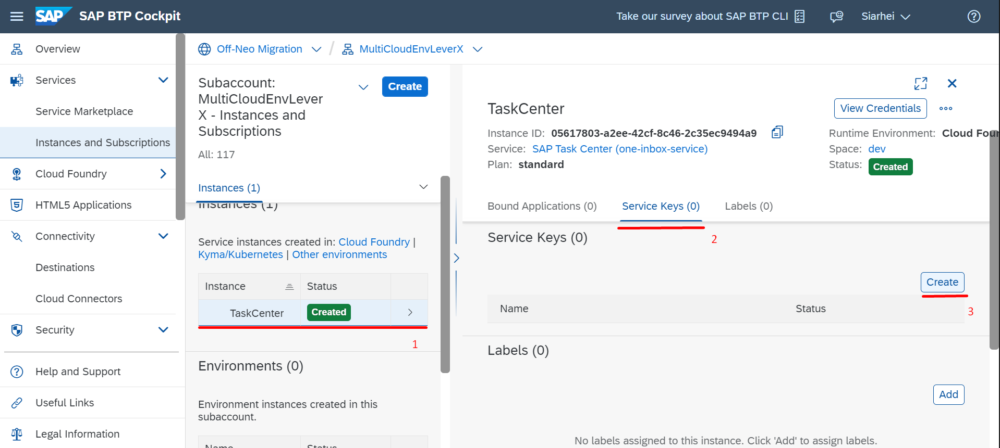

- Specify meaningful Service Key name
- Specify the following parameters in JSON format

``` JSON
{
    "xsuaa": {
        "credential-type": "x509",
        "x509": {
            "key-length": 2048,
            "validity": 1,
            "validity-type": "YEARS"
        }
    }
}
```

- Click **Create** button 

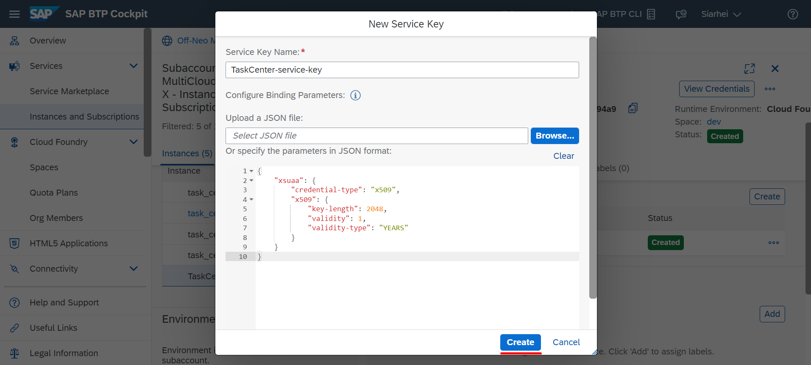

As a result, a service key for the newly created SAP Task Center service instance has been created


### Step 3: Set up the service destinations

1. Go to Destinations tab
2. Create SAP Task Center Global Settings Destination

- Click **New Destination** button
- Fill in Name field with value **Task_Center_global_settings**
- Fill in URL field with value **http://sap.com/**
- Click **New Property** button
- Add **tc.languages** with value **en-US,de-DE**
- Click **Save** button

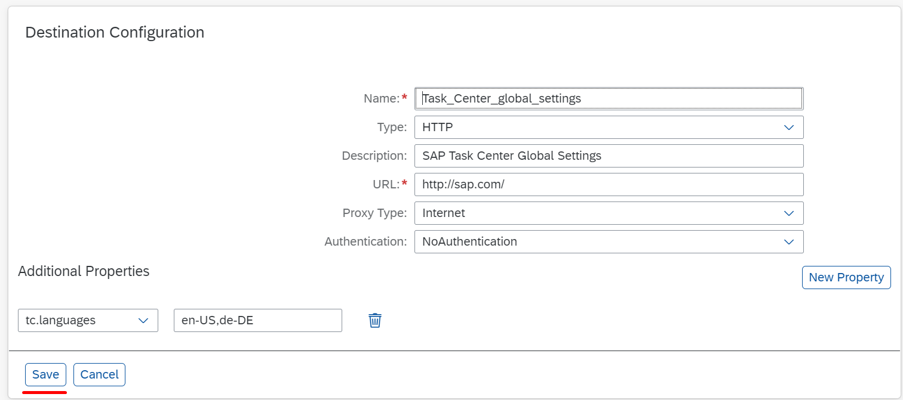

3. Create Identity Directory Connectivity Destination

- Click **New Destination** button
- Fill in Name field with value **Identity_Authentication_Connectivity_IDS**
- Fill in URL field with value https://\<tenant ID\>.accounts.ondemand.com/scim *Example:* **https://at3rbntb4.accounts.ondemand.com/scim**
- Choose **BasicAuthentication** from Authentication dropdown
- Fill in User field with client ID of the Service Administrator you created during IAS Configuration
- Fill in Password field with client secret of the Service Administrator you created during IAS Configuration
- Click **Save** button

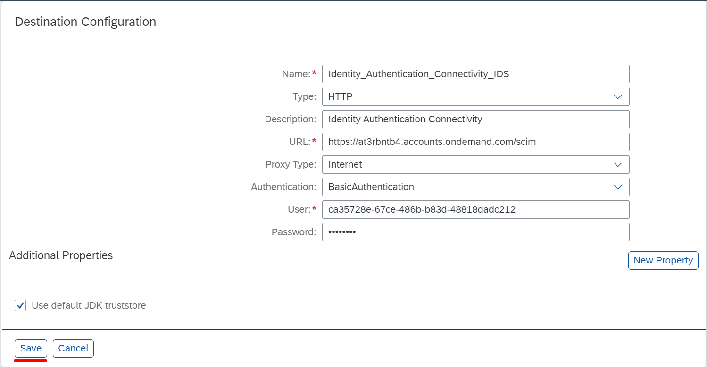

4. Create a Destination for the SAP Build Work Zone, standard edition

- Click **New Destination** button
- In the Destination Configuration section, choose **Service Instance**
- From the Service Instance dropdown choose the SAP Task Center service Instance name you created
- Specify meaningful Destination name
- Click **Next** button. All the mandatory fields will be populated automatically
- Click **Save** button

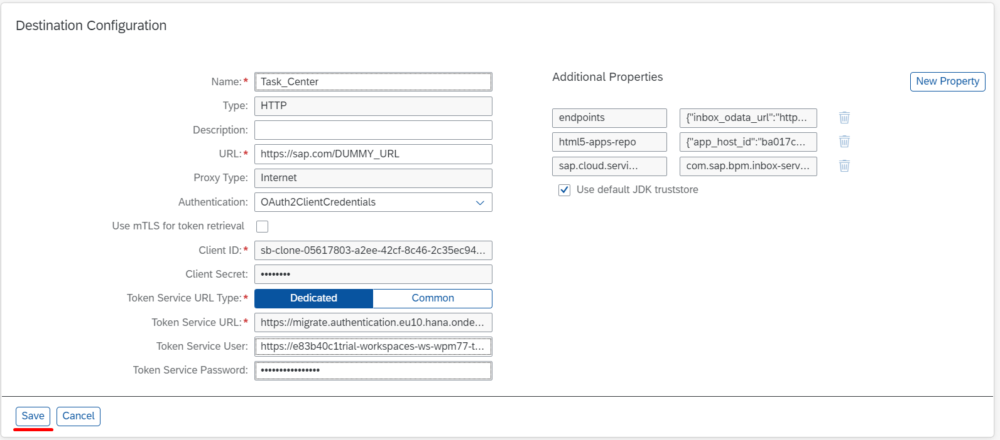


As a result, all required Destinations have been created and displayed in Destinations table


### Step 4: Create Task Center and Task Center Administration Tiles on SAP Build Work Zone, Standard Edition

1. go to Instances and Subscriptions tab
2. In the Subscriptions section, search for the **SAP Build Work Zone, Standard Edition** and choose Go to Application

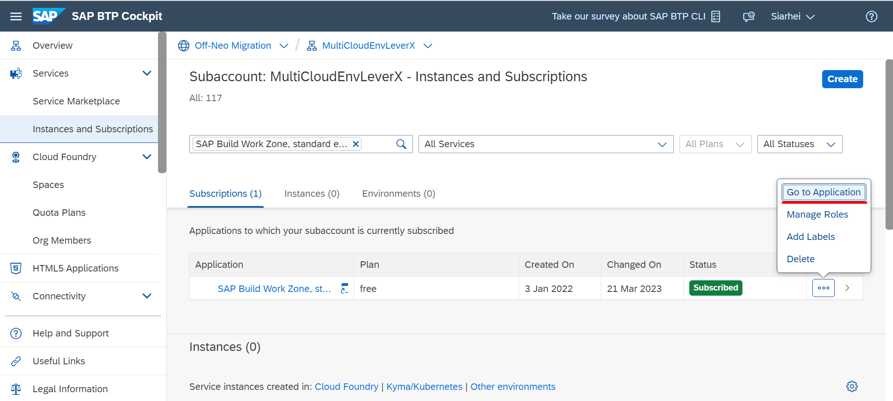

3. In the new window, go to Channel Manager
4. On HTML 5 Apps, choose Update content below Actions to fetch the updated content

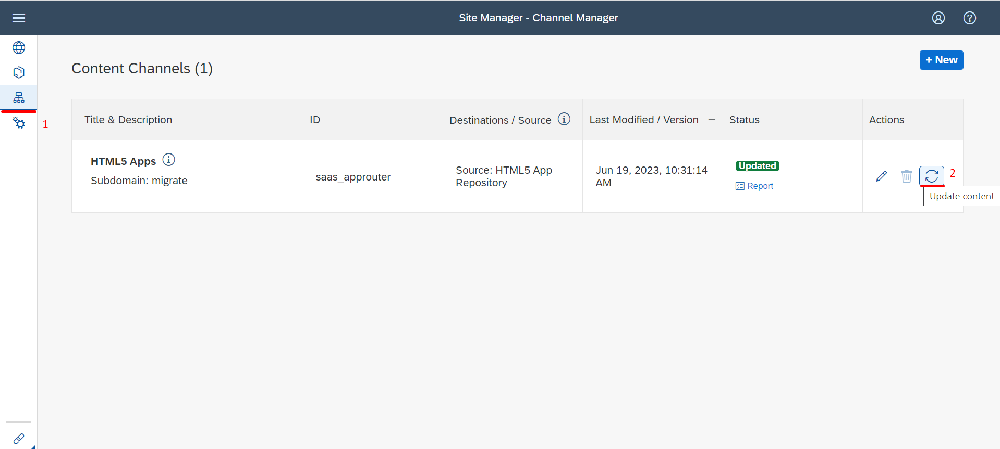

5. Add Task Center and Task Center Administration Tiles to My Content

- Go to Content Manager 
- Go to Content Explorer tab then choose **HTML5 Apps** tile

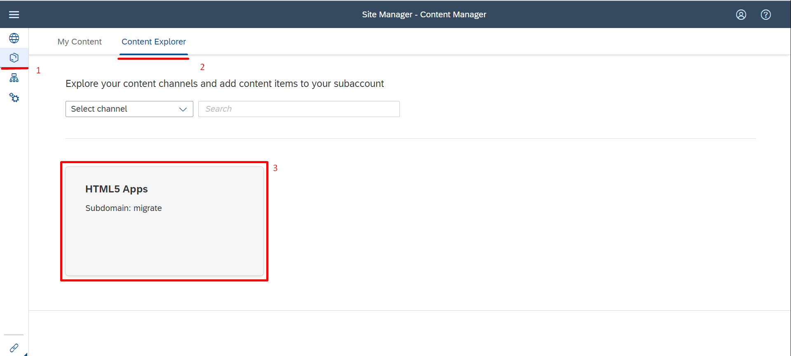

- Select the **Task Center** item and **Task Center Administration** item

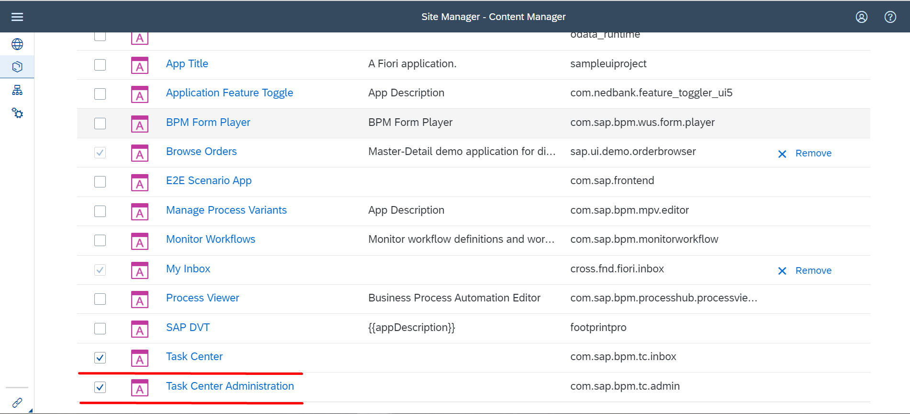

- Click **Add to My Content** button

6. Create a new Group for Task Center Tiles

- Go to the My Content tab
- Click **New** button
- Choose **Group** from the popup 

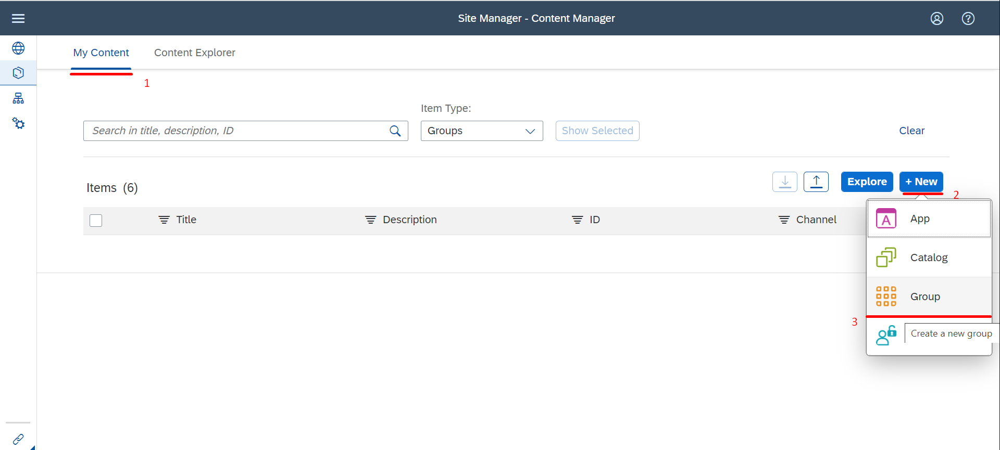

- Specify meaningful Title
- Assing **Task Center** item to the Group
- Assing **Task Center Administration** item to the Group
- Click **Save** button

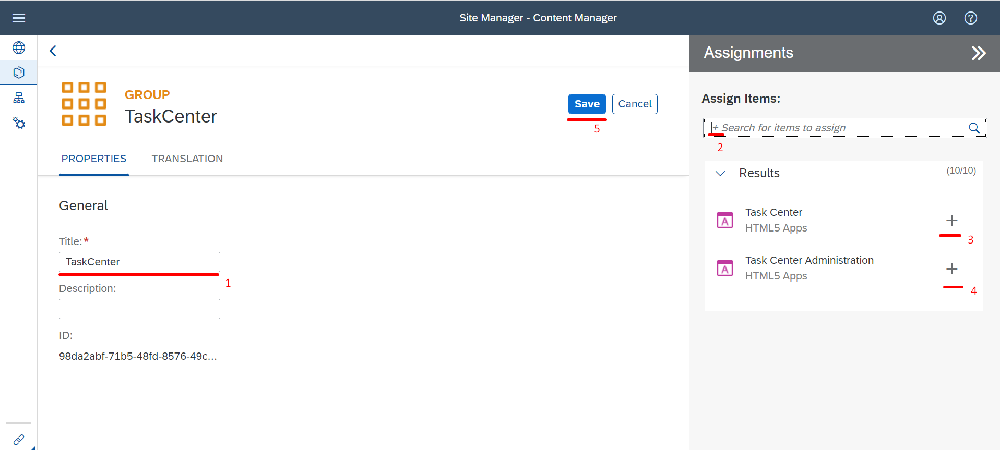

7. Assign the Task Center to the existing **Everyone** role

- On My Content tab, search for **Everyone** item and select it

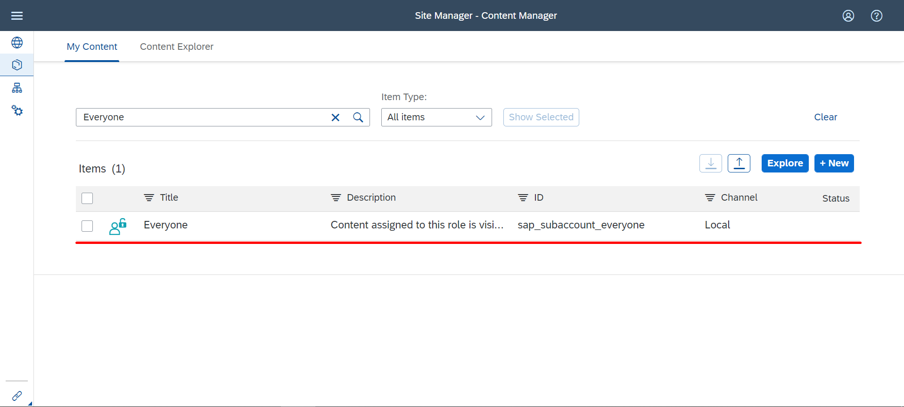

- Click **Edit** button
- Assign **Task Center** and **Task Center Administration** items to the Role
- Click **Save** button

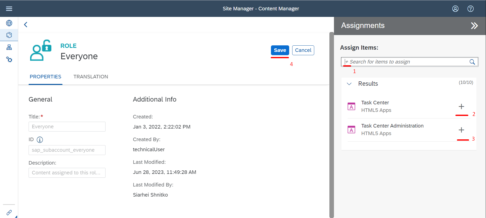

8. Create a new Site

- Go to Site Derictory tab
- Click **Cretae Site**

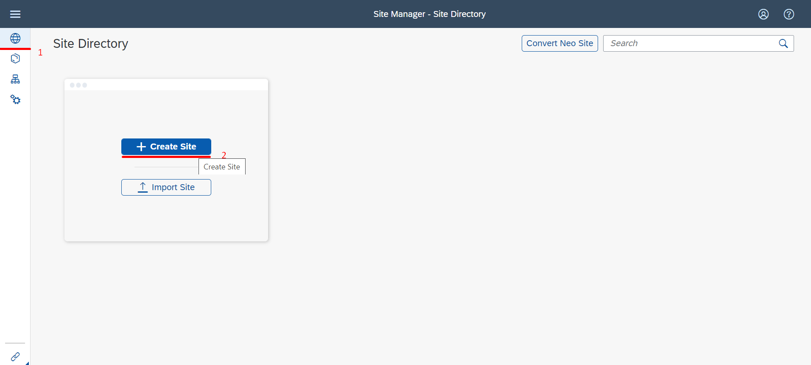

- Specify meaningful Site Name
- Click **Create** button

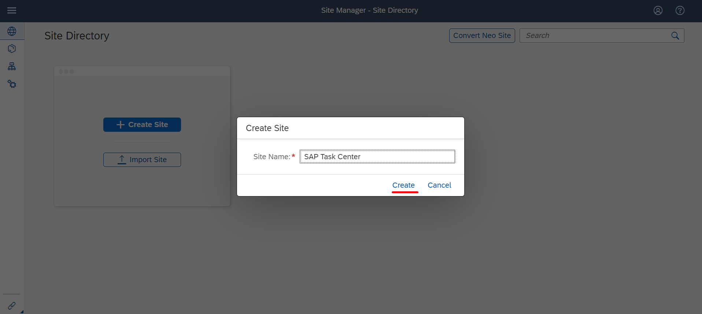

As a result, SAP Task Center has been configured. Both **Task Center** and **Task Center Administration** tiles are reachable from the newly created site

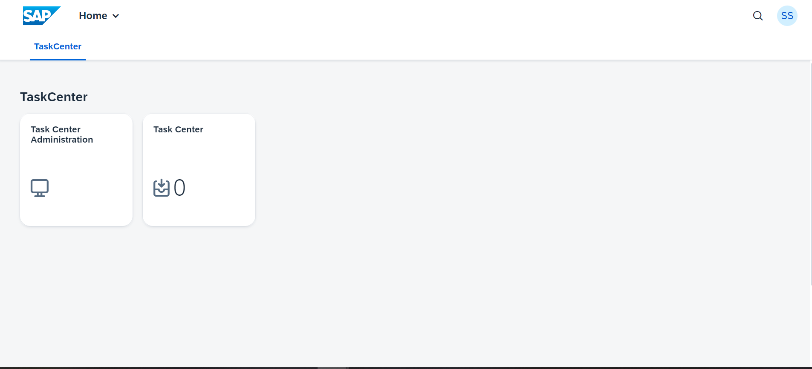


Proceed to the next step: [3 Configure BTP for SuccessFactors tasks provider](https://github.com/Sereg20/Task_Center/blob/master/BTP_config/3%20Config%20BTP%20for%20SF/README.md)
