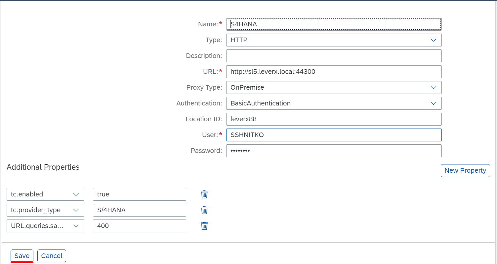

## Details

With this step you will create required Destination on BTP to make SAP S4HANA On-Premise tasks provider reachable

### Step 1: Create your Backend system Destination 

1. Access you SAP BTP Subaccount
2. Go to Destinations tab
3. Create a Destination

- Click **New Destination** button
- Fill in Name field with value **S4HANA**
- Fill in URL field following the pattern <Virtual Host>:<Virtual Port>, using the values you've got during SAP Cloud Connector Configuration
- Choose **OnPremise** from Proxy Type dropdown
- Choose **BasicAuthentication** from Authentication dropdown
- Fill in User field with the Service User from your ABAP system
- Fill in Password field with the password for the Service User from your ABAP system
- (Optional) Fill in Location ID field in case you specified it during SAP Cloud Connector Configuration
- Click **New Property** button
- Add **tc.enabled** with value **true**
- Add **tc.provider_type** with value **S/4HANA**
- Add **URL.queries.sap-client** with the client number of the SAP S4HANA system
- Click **Save** button

As a result, the Destination has been created and displayed in Destinations table
