## Details

With this step you will set up Trust Configuration between BTP Subaccount and IAS tenant via exchanging SAML Metadata files between your BTP Subaccount and IAS tenant and vice versa

### Step 1: Create a new app in IAS

1. Access you IAS admin console via link: https://\<your IAS tenant\>.accounts.ondemand.com/admin
2. Create a new app

- Go to the Applications tile

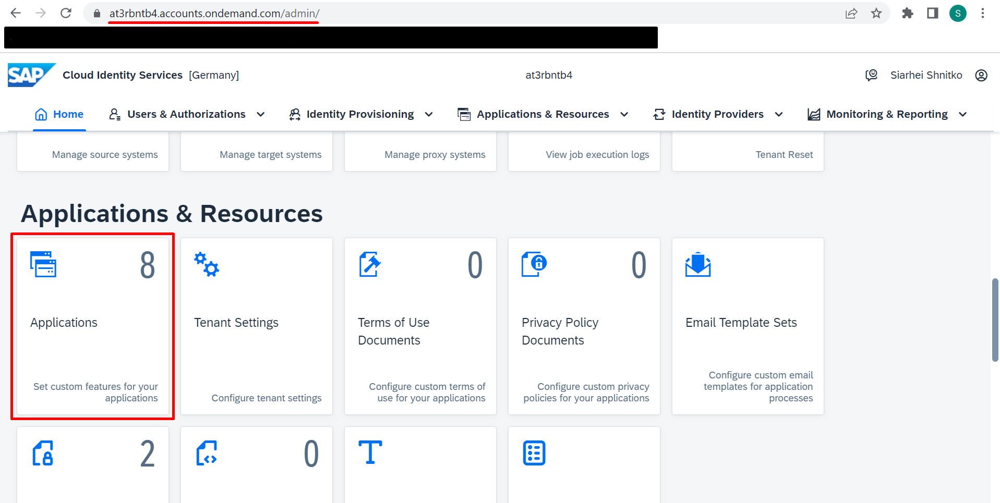

- Click **Create** button
- In Create Application popup fill in the Display Name field and click **Save** button

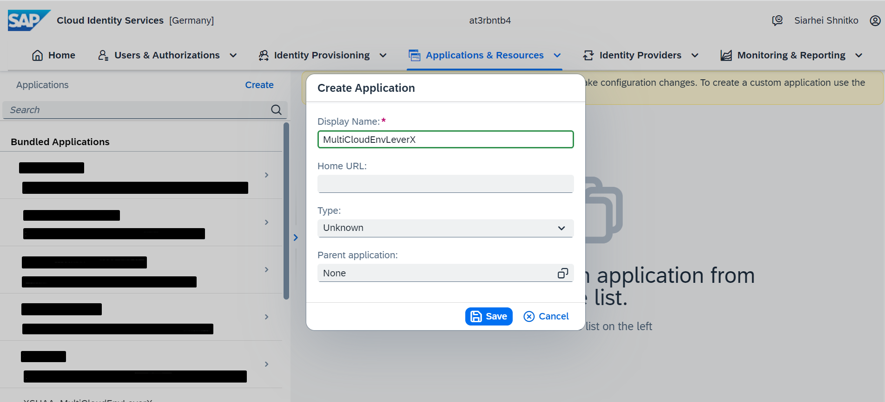

As a result, the newly created app is displayed in Charged Applications list

### Step 2: Download SAML Metadata from tenant settings

1. Go to Tenant Settings tab

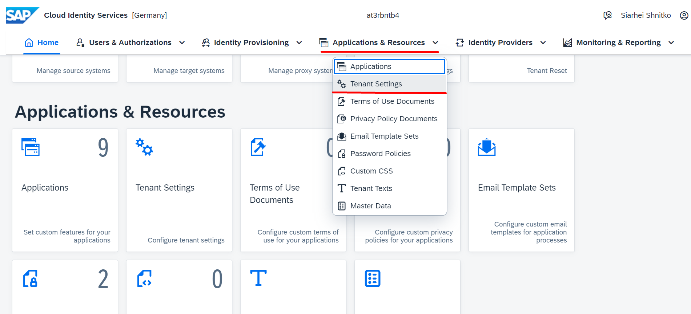

2. Go to SAML 2.0 Configuration under Single Sign-On tab
3. Download SAML Metadata to your local computer via clicking **Download Metadata File** button

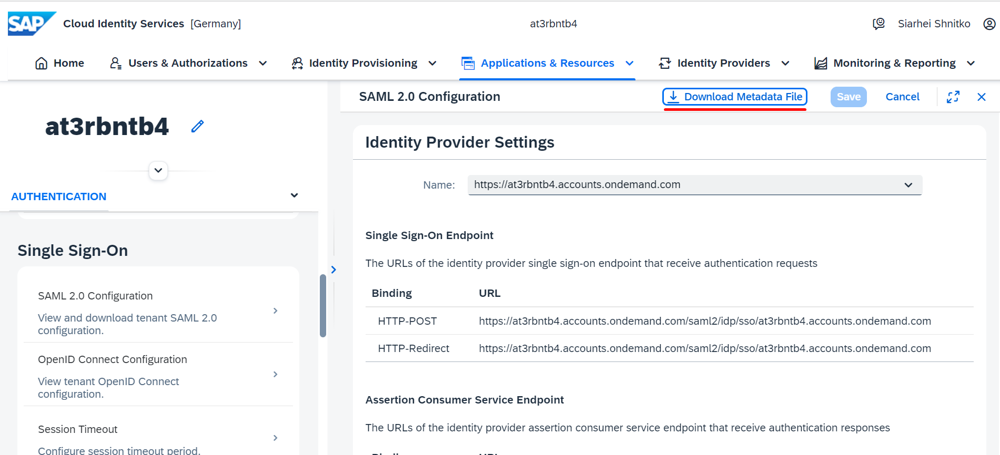

As a result, the SAML Metadata of your tenant has been downloaded to your local computer

### Step 3: Create a new Trust Configuration in BTP

1. Access your BTP Subaccount

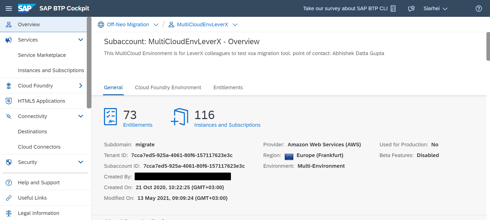

2. Create a new Trust Configuration using the SAML Metadata from the previous step

- Go to Trust Configuration tab
- Click **New Trust Configuration** button

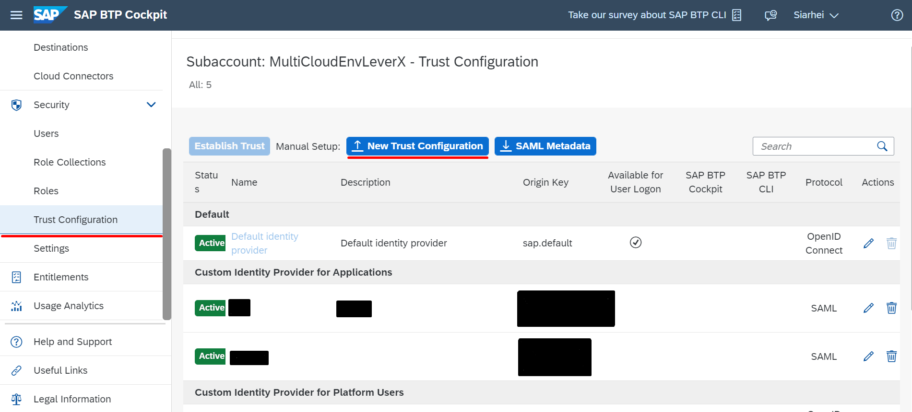

- Upload the SAML Metadata file from your local computer via clicking **Upload** button in New Trust Configuration popup
- Fill in the Name field with an appropriate name and click **Save** button

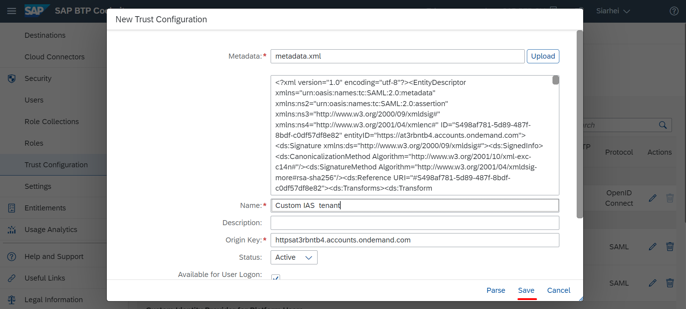

As a result, new Trust Configuration has been established and displayed in Trust Configuration list in your BTP Subaccount

### Step 4: Download SAML Metadata from BTP Subaccount

1. Go to Trust Configuration tab
2. Download SAML Metadata to your local computer via clicking **SAML Metadata** button

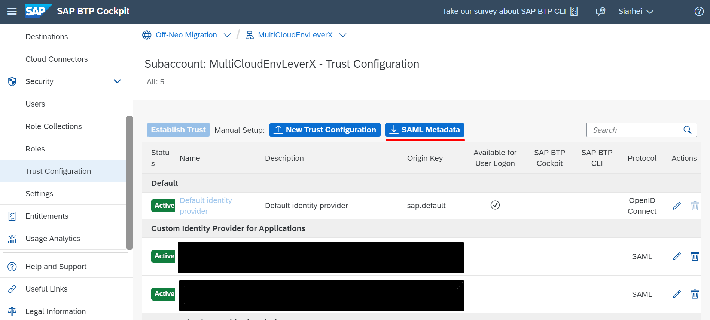

As a result, the SAML Metadata of your BTP Subaccount has been downloaded to your local computer

### Step 5: Establish Trust Configuration in IAS tenant

1. Access you IAS admin console
2. Establish Trust Configuration via uploading the BTP Subaccount SAML Metadata file to the newly created app in IAS

- Go to Applications tab and choose the newly created app

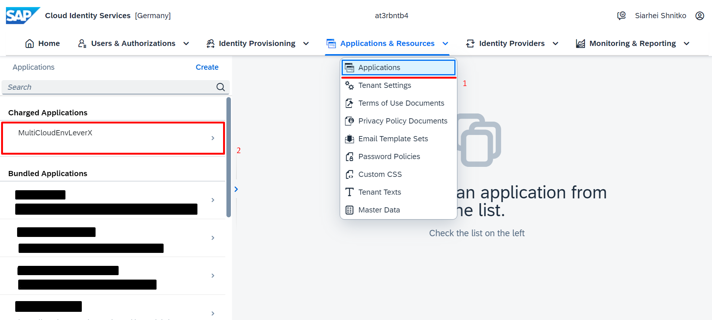

- Go to SAML 2.0 Configuration under Trust tab which is not configured yet

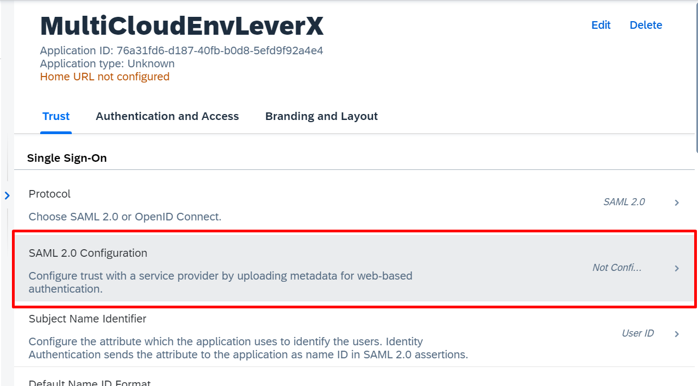

- Upload the BTP Subaccount SAML Metadata file from your local computer to the IAS tenant via clicking **Browse...** button
- Click **Save** button

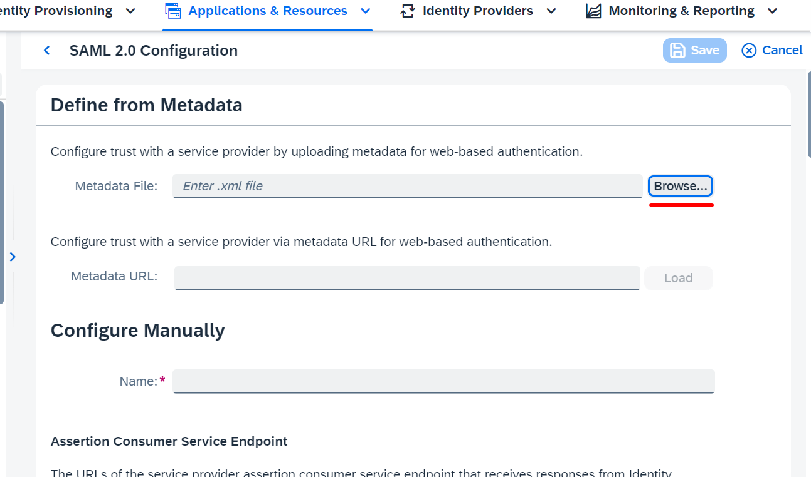

As a result, the trust configuration between your BTP subaccount and IAS tenant has been established. In IAS admin console you can see your app in Bundled Applications list

Proceed to the next step: [2 Configure Subject Name Identifier](https://github.com/Sereg20/Task_Center/tree/master/IAS_config/2%20Attributes)