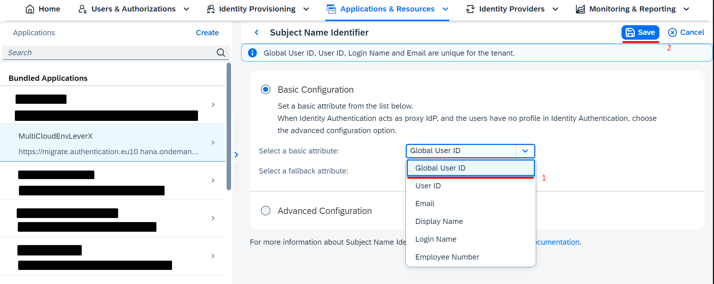

## Details

With this step you will configure Subject Name Identifier in order to enable Principal Propagation mechanism 

### Step 1: Set Subject Name Identifier value to Global User ID

1. Access you IAS admin console
2. Set Subject Name Identifier value as Global User ID

- Go to Applications tab and choose the App
- Go to Subject Name Identifier under Trust tab
- Choose **Global User ID** value from Select a basic attribute dropdown

- Click **Save** button

As a result Subject Name Identifier has value of User UUID. This configuration allows Principal Propagation mechanism to identify user by uniquie UUID field

Proceed to the next step: [3 Create User Group](https://github.com/Sereg20/Task_Center/blob/master/IAS_config/3%20User%20Group/README.md)