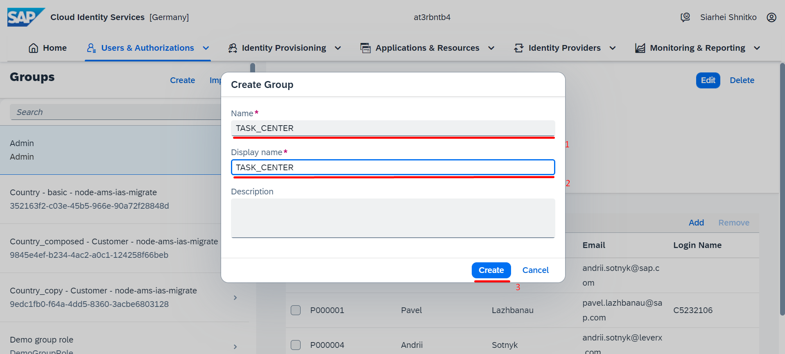
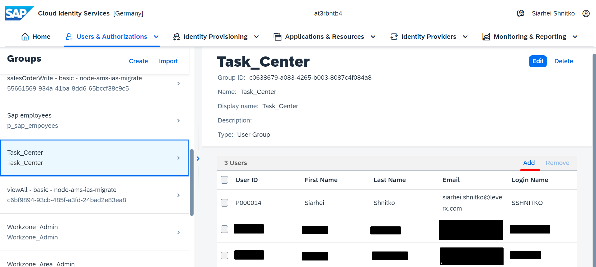

## Details

With this step you will create a User Group and store all Task Center business users in one place

### Step 1: Create a User Group

1. Create a User Group

- Go to User Groups tab
- Click **Create** button
- Fill in Name and Dispaly name fields with value **TASK_CENTER**

- Click **Create** button

As a result, a new User Group TASK_CENTER is created

### Step 2: Add Task Center business users to the User Group TASK_CENTER

1. Access the newly created user Group from **Groups** list on the left hand side
2. Add Task Center business user to the User Group

- Click **Add** button

- Select required users from Add Users list
- Click **Save** button

As a result, User Group TASK_CENTER is populated with Task Center business users 
