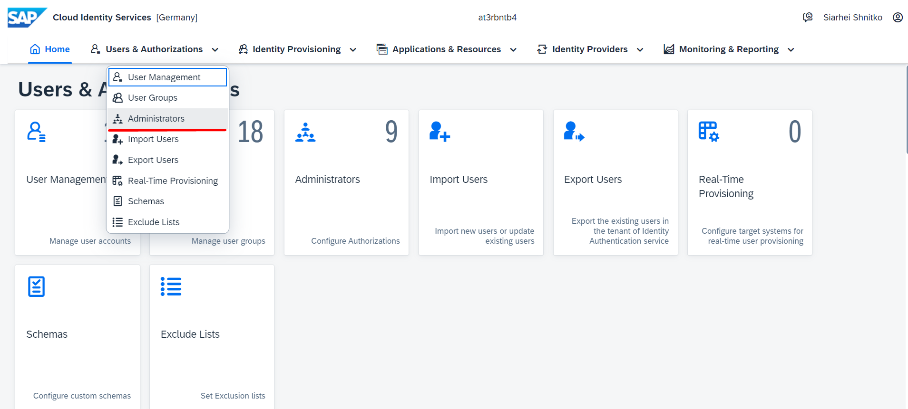
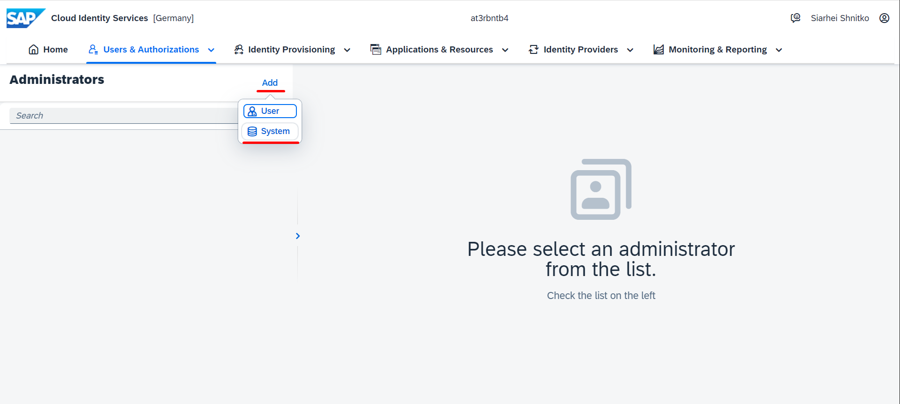
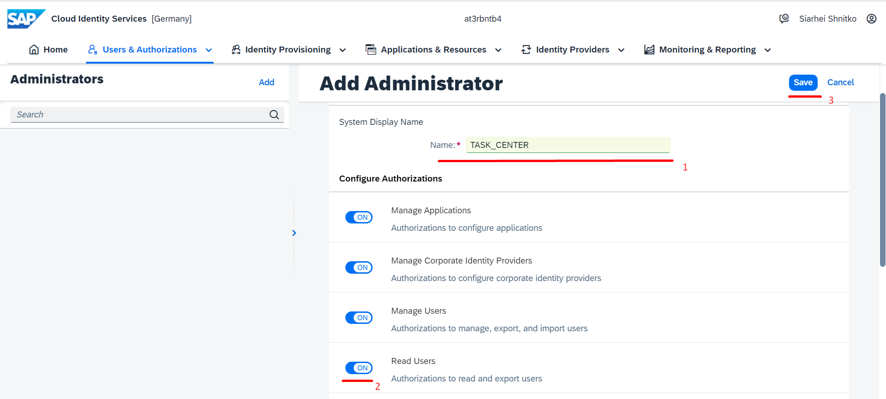
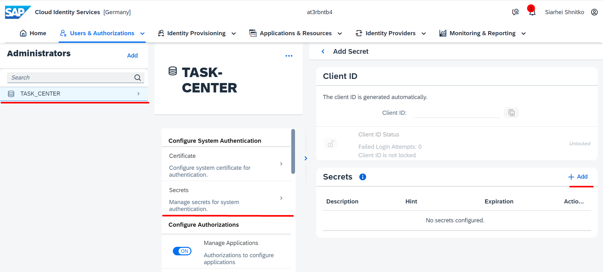
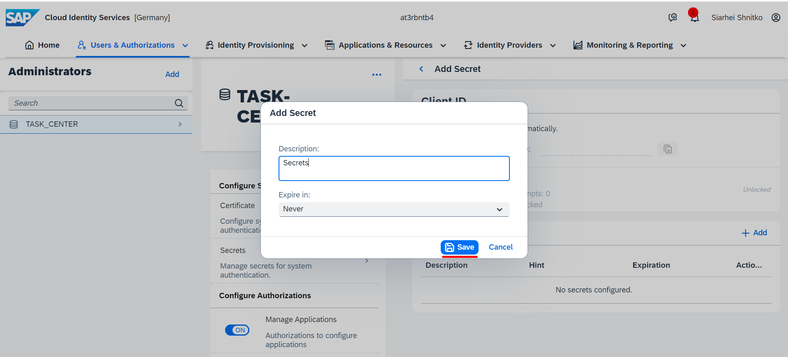

## Details

With this step you will create a System Administrator which is required for Users Provisioning via Identity Provisioning Service (IPS)

### Step 1: Create a System Administrator

1. Go to Administrators tab

2. Create a System Administrator

- Click **Add** button
- Select **System** option

- Fill in Name with value **TASK_CENTER**
- Switch on **Read Users** Authorization

- Click **Save** button

As a result, a new System Administrator is created

### Step 2: Add Secrets to the Administrator

1. Select the newly created System Administrator
2. Add new secrets
- Go to Secrets
- Click **Add** button

- (Optional) Specify meaningful description
- Click **Save** button

- Copy Client ID and Client Secret values from the popup. You'll need these values later

As a result, System Administrator secrets are created and stored for future use
