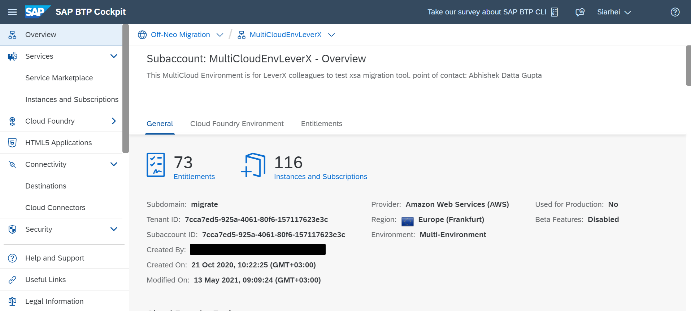

## Details

With this step you will create an RFC Destination on BTP to allow Users data Provisioning from IAS (Cloud) to S4HANA (On-Premise)  
The Destination is required during Source System configuring

### Step 1: Create an RFC Destination for Users data Provisioning

1. Access you SAP BTP Subaccount

2. Go to Destinations tab
3. Create Primary Destination

- Click **New Destination** button
- Fill in Name field with value **RFC**
- Choose **RFC** from Type dropdown
- Choose **OnPremise** from Proxy Type dropdown
- Fill in User field with the Service User from your ABAP system
- Fill in Password field with the password for the Service User from your ABAP system
- (Optional) Fill in Location ID field in case you specified it during SAP Cloud Connector Configuration
- Click **New Property** button
- Add **jco.client.ashost** with the application server name of the target ABAP system
- Add **jco.client.client** with the client number of the SAP S4HANA system
- Add **jco.client.sysnr** with the instance number of the application server
- Click **Save** button

As a result, the RFC Destination has been created and displayed in Destinations table

Proceed to the next step: [2 Source System Configuration](https://github.com/Sereg20/Task_Center/blob/master/IPS_config/1%20Source%20System%20Config/README.md)