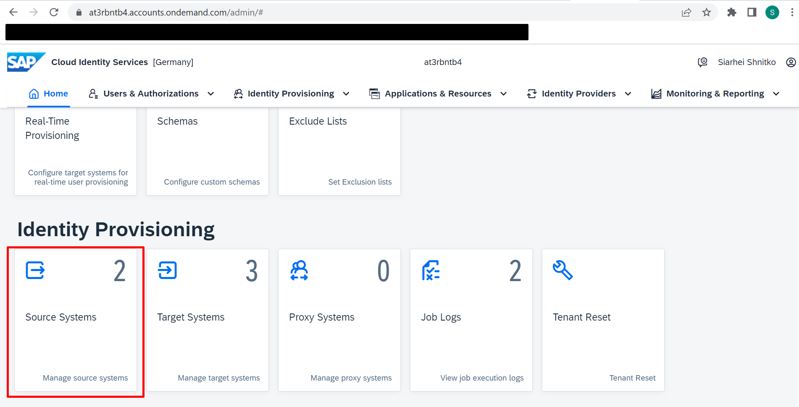

## Details

With this step you will configure Source system for IPS Provisioning job

The Source system will be Identity Authentication system

### Step 1: Create Source system

1. Access your IAS tenant admin console
2. On the Home Page, go to Source Systems tile

3. Create a Source system

- Click **Add** button

- Choose **Identity Authentication** from Type Dropdown
- Specify meaningful System name
- Click **Save** button

As a result, a Source system is created and displayed in Source Systems list on the left hand side 

### Step 2: Specify Properties for the Source system

1. Choose the newly created Source system
2. Go to Properties tab and specify the following properties

- ProxyType - Internet
- Type - HTTP
- URL - URL of your IAS tenant
- Authentication - BasicAuthentication
- User - Client ID of the System Administrator that was created during IAS configuration
- Password - Password of the System Administrator that was created during IAS configuration
- ias.group.filter - displayName eq "**Task_Center**" (the value is equal to the User Group name that was created during IAS Configuration)
- ias.user.filter - groups.display eq "**Task_Center**" (the value is equal to the User Group name that was created during IAS Configuration)

3. Save changes

As a result, all required properties are specified for the Source system

Proceed to the next step: [2 Task Center Config](https://github.com/Sereg20/Task_Center/blob/master/IPS_config/2%20Target%20System%20Config/README.md)
