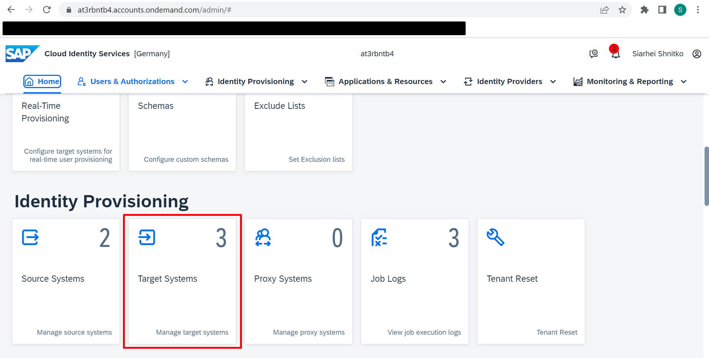
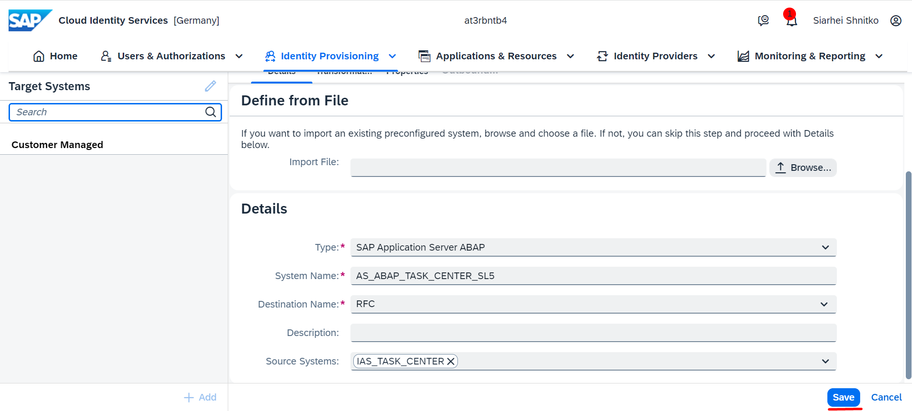
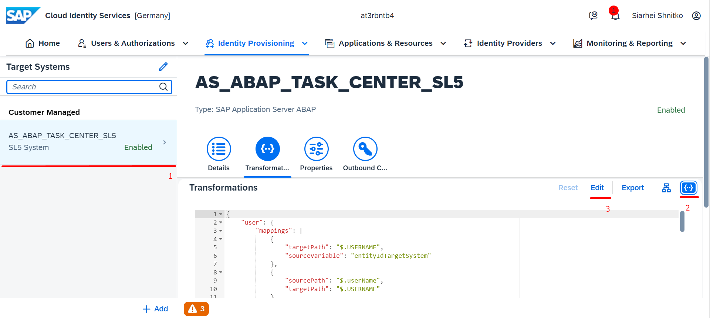
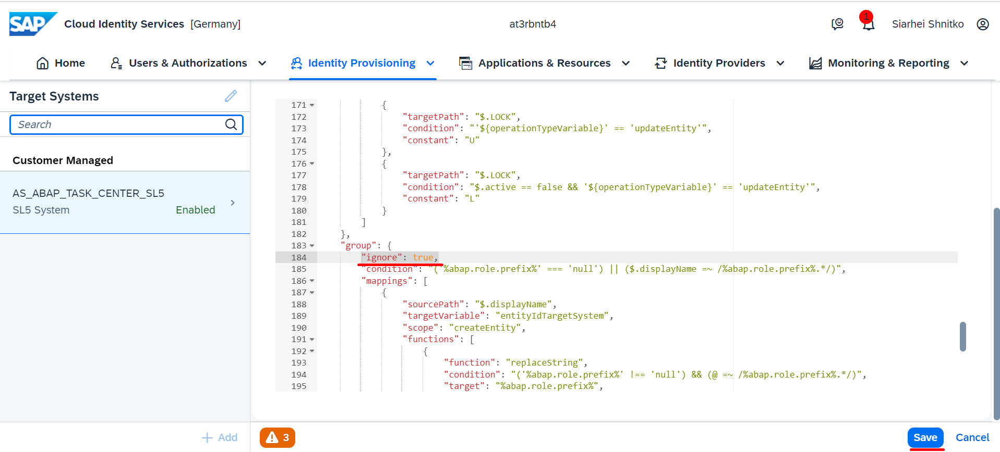

## Details

With this step you will configure Target system for IPS Provisioning job

The Target system will be SAP Application Server ABAP

### Step 1: Create Target system

1. Access your IAS tenant admin console
2. On the Home Page, go to Target Systems tile

3. Create a Target system

- Click **Add** button
- Choose **SAP Application Server ABAP** from Type Dropdown
- Specify meaningful System name
- Choose the RFC destination that was created during SAP BTP Configuration
- Choose **IAS TASK CENTER** from Source Systems dropdown
- Click **Save** button

As a result, a Target system is created and displayed in Target Systems list on the left hand side 

### Step 2: Configure Transformation for the Target system

1. Choose the newly created Source system
2. Go to Transformations tab and adjust transformation config

- Switch to JSON editor
- Click **Edit** button

- Scroll to **group** section
- Under group secion add **"ignore": true,**
- Click **Save** button

As a result, Target system Transformation is adjusted properly

Proceed to the next step: [3 Run Provisioning Job](https://)
