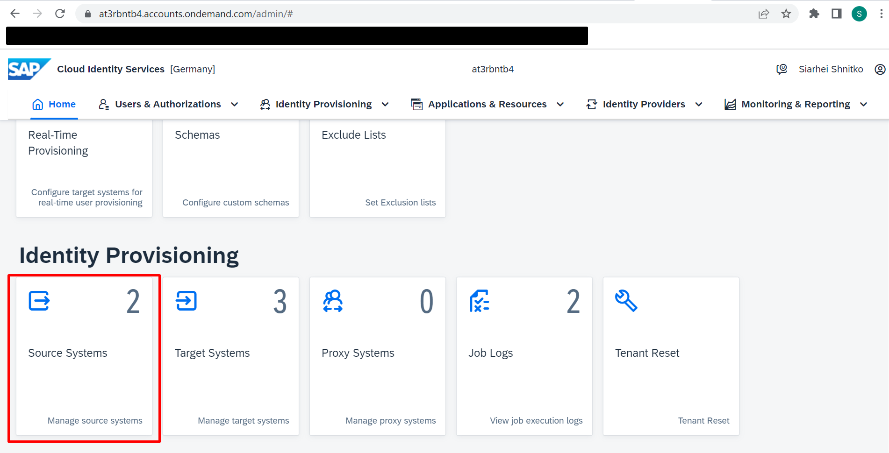
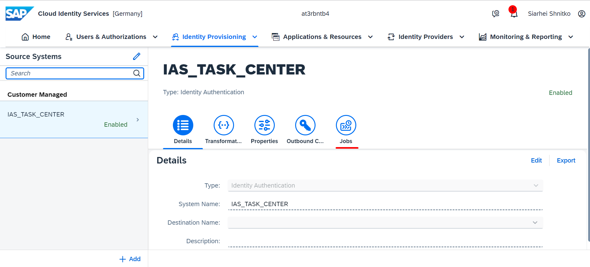
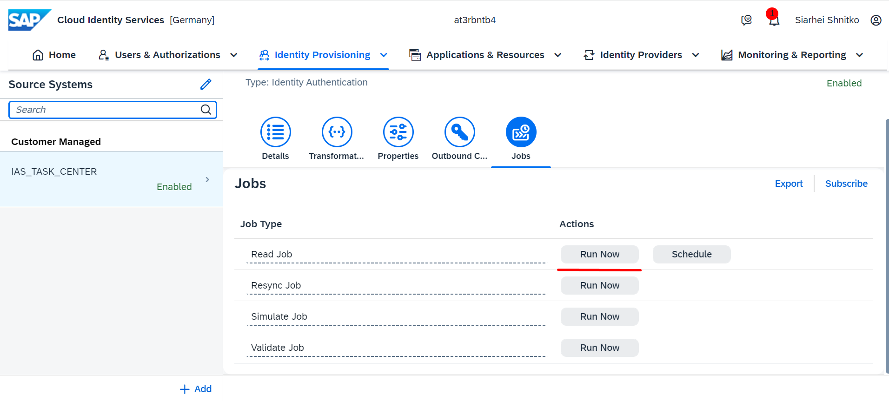
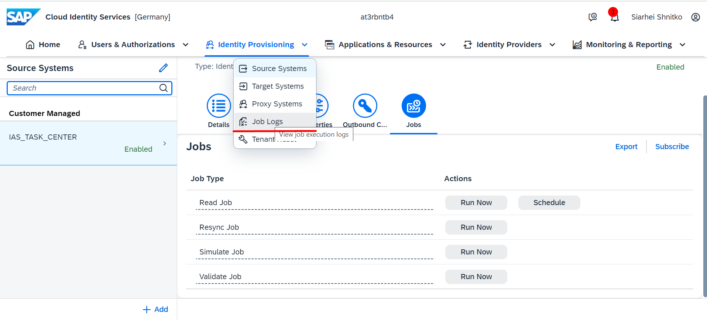
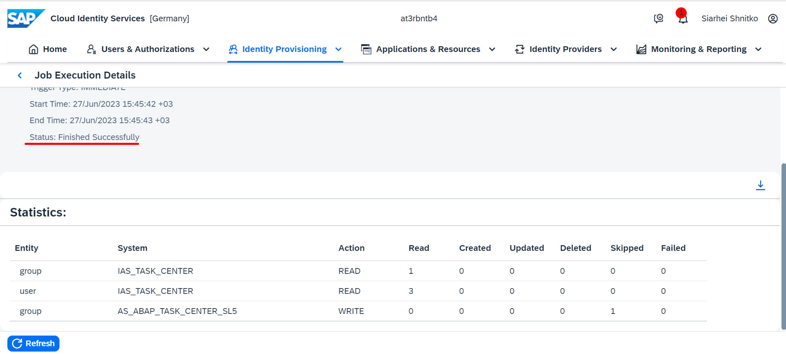

## Details

With this step you will run Provisioning job to provision Users data from IAS to SAP S4HANA On-Premise system

### Step 1: Run Provisioning job

1. Access your IAS tenant admin console
2. On the Home Page, go to Source Systems tile

3. Choose the Source system you created 
4. Go to Jobs tab

5. Run Read Job

As a result, the Provisioning job has been successfully triggered

### Step 2: Check the job's result

1. Go to Job Logs

2. Check the job status (should be **Finished Successfully**). In case the status is **Finished with Error** check the job logs and fix an issue 

