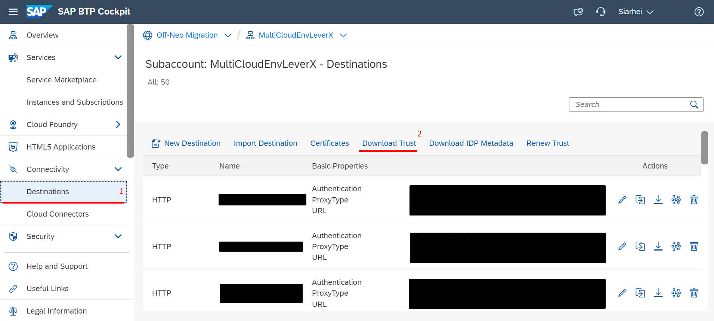
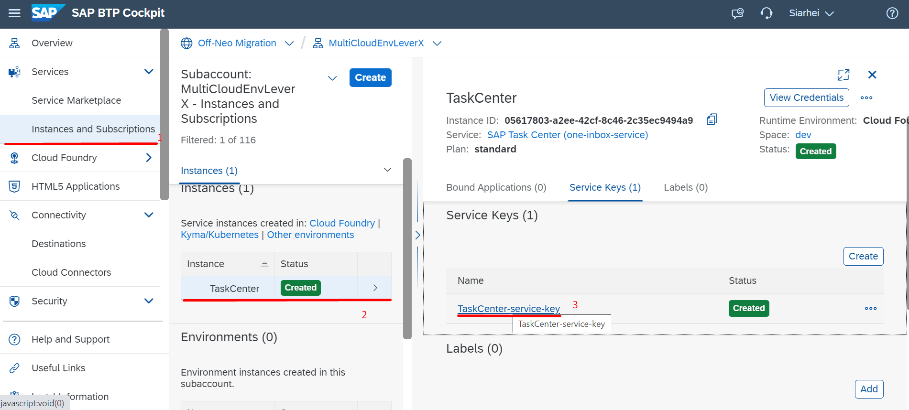

## Details

With this step you will grab all required data from BTP Subaccount including Destination trust file and SAP Task Center service key info 

### Step 1: Download Destination Trust

1. Access your BTP Subaccount
2. Go to Destinations Tab
3. Download Trust to your local computer via clicking on **Download Trust** button

As a result, the Trust has been successfully saved on your local computer

### Step 2: Save SAP Task Center service key info 

1. Access your BTP Subaccount
2. Go to Instances and Subscriptions Tab
3. Access the SAP Task Center service instance
4. On the service instance, choose service key

5. Copy the following parameters:

- inbox_rest_url
- uaa –> clientid
- uaa –> client secret
- uaa –> url

As a result, all required SAP Task Center Service key parameters have been copied

Proceed to the next step: [2 Maintain Communication User](https://)
