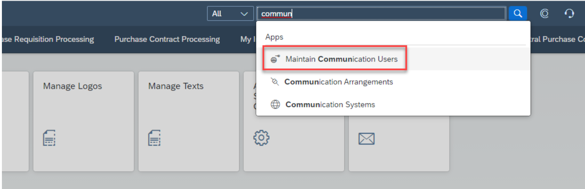
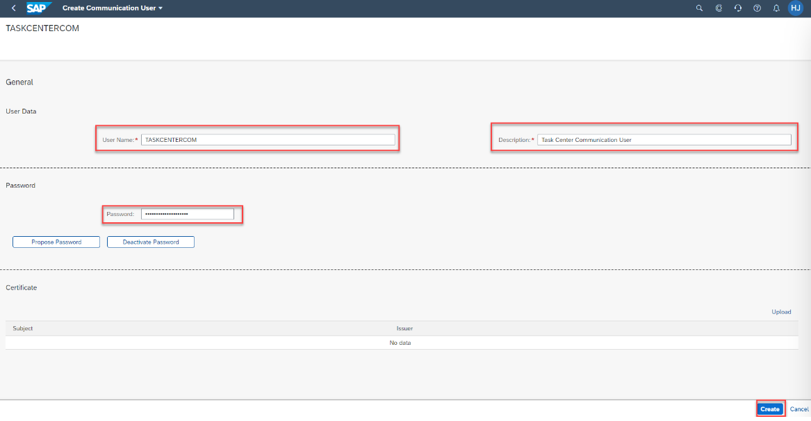
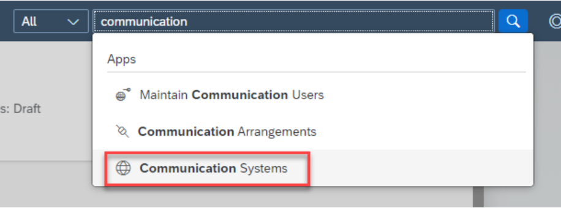
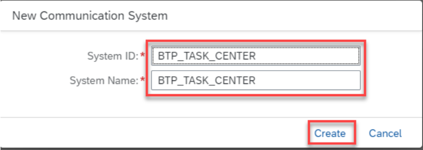
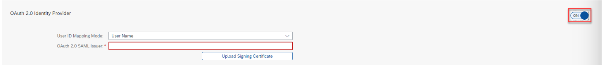
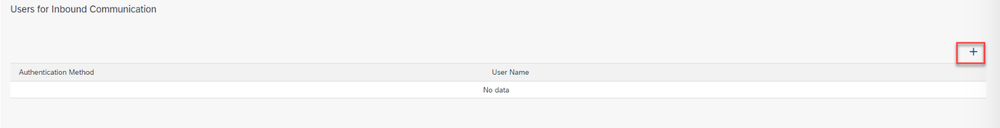
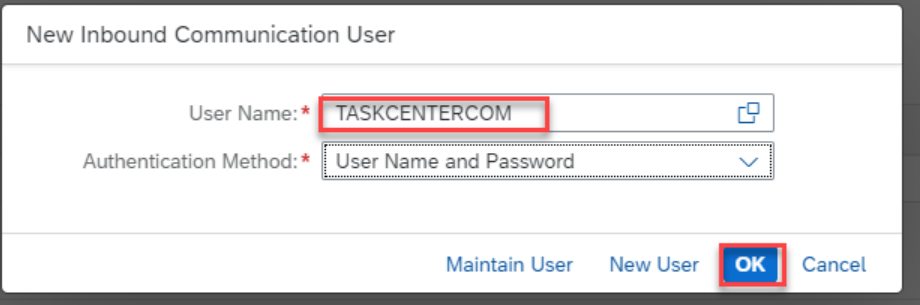
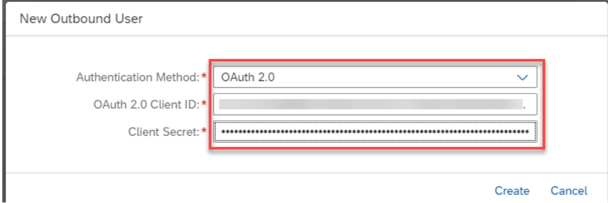
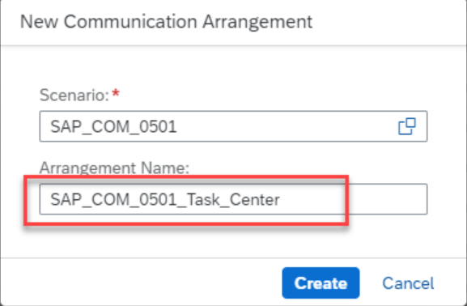
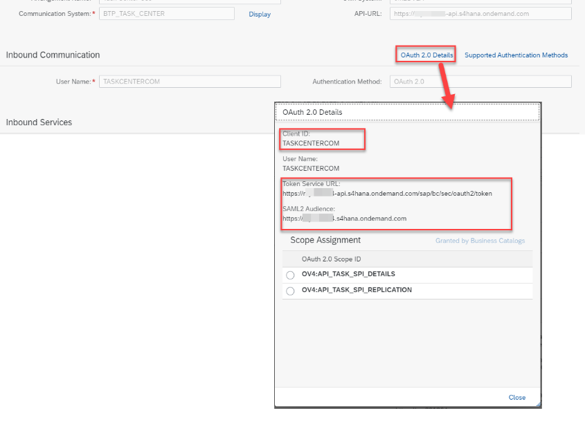

## Details

With this step you will create and configure Communication User

### Step 1: Create Communication User

1. Access S4HANA Cloud system
2. Go to **Maintain Communication Users**

3. Create new Communication User

- Click **New** button
- Specify a User Name, Description, and Password
Click **Create** button

As a result, Communication User has been created

### Step 2: Configure Communication System

1. Go to **Communication Systems**

2. Create a new Communication System

- Click **New** button
- Specify a System ID and System Name
- Click **Create** button

3. Fill in the reauired fields

- Host Name field - inbox_rest_url copied earlier. Remove **https://** from the front and **/task-center-service** from the end
- Under OAuth 2.0 Settings, Auth. Endpoint - uaa –> url value from BTP config steps and append /oauth/authorize at the end
- Under OAuth 2.0 Settings, Token Endpoint - uaa –> url value from BTP config steps and append /oauth/token at the end

4. Enable OAuth 2.0 Identity Provider

5. Upload the Trust file you downloaded from the BTP subaccount earlier by clicking **Upload Signing Certificate** button
6. Copy the value after **CN=** and paste it in the OAuth 2.0 SAML Issuer box
7. Switch the User ID Mapping Mode to **Global User ID**
8. Add User for Inbound Communication

- Click **+** under User for Inbound Communication

- Select the Communication user created earlier
- Click **OK** button

9. Add User for Outbound Communication

- Click **+** under Users for Inbound Communication
- Fill in the fields:
 - Authentication Method - **OAuth 2.0**
 - OAuth 2.0 Client ID - uaa -> clientid copied from BTP config steps
 - Client Secert - uaa –> clientsecret copied from BTP config steps
- Click **Create** button

10. Save your Communication User

As a result, the Communication User has been completely configured

### Step 3: Get OAuth 2.0 Communication Details

1. Go to **Communication Arrangements**
2. Select **SAP_COM_0501** from New Communication Arrangement Value Help Dialog

3. Use the value help icon and select the Communication System created earlier
4. Click **OAuth 2.0 Details** button
5. Copy Client ID, Token Service URL and SAML2 Audience fields. These fields are required to configure the destination setting in the BTP subaccount

As a result, you have all required Communication Arrangements data

Proceed to the next step: [2 Create BTP Destination](https://github.com/Sereg20/Task_Center/blob/master/S4HANA_Cloud_config/2%20Create%20BTP%20Destination/README.md)
