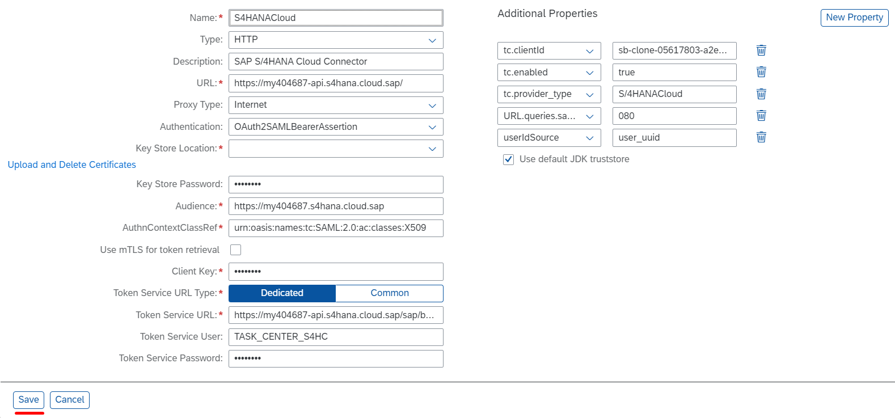

## Details

With this step you will create a required Destinations on BTP to make SAP S4HANA Cloud tasks provider reachable

### Step 1: Create a Destination

1. Access you SAP BTP Subaccount
2. Go to Destinations tab
3. Create the Destination

- Click **New Destination** button
- Fill in Name field with value **S4HANACloud**
- Fill in URL field with the URL for your SAP S4HANA Cloud system
- Choose **OAuth2SAMLBearerAssertion** from Authentication dropdown
- Fill in Audience field with SAML2 Audience value copied from the OAuth 2.0 details (previous step)
- Fill in AuthnContextClassRef field with value **urn:oasis:names:tc:SAML:2.0:ac:classes:X509**
- Fill in Client Key field with the Client ID value copied from the OAuth 2.0 details (previous step)
- Fill in Token Service URL field with Token Service URL value copied from OAuth 2.0 details (previous step) 
- Fill in Token Service User field with Communication User Name created in previous step
- Fill in Token Service Password field with Communication User Password created in previous step
- Click **New Property** button
- Add **URL.queries.sap-client** with your SAP Client
- Add **tc.clientId** with the value of the uaa clientid from the service key of the service instance you created within BTP Configuration steps
- Add **tc.enabled** with value **true**
- Add **tc.provider_type** with value **S/4HANACloud**
- Add **userIdSource** with value **user_uuid**
- Click **Save** button

As a result, the Destination has been created and displayed in Destinations table
