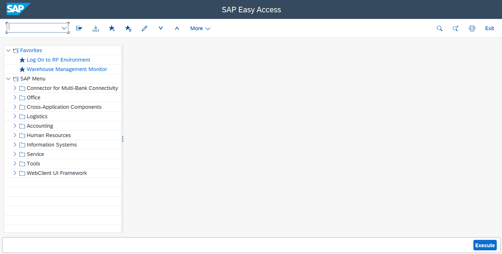
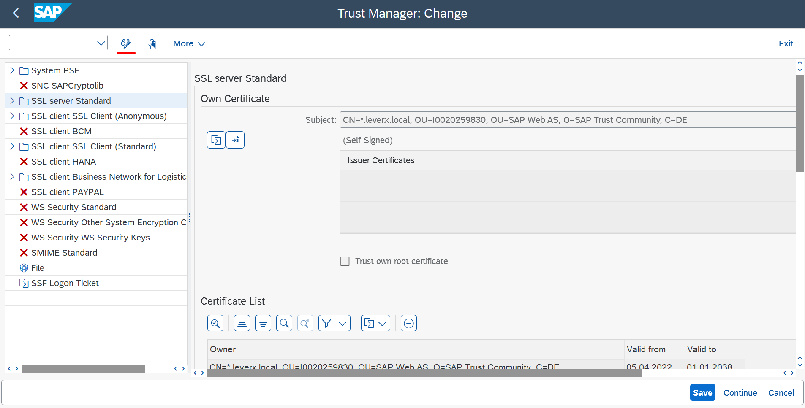
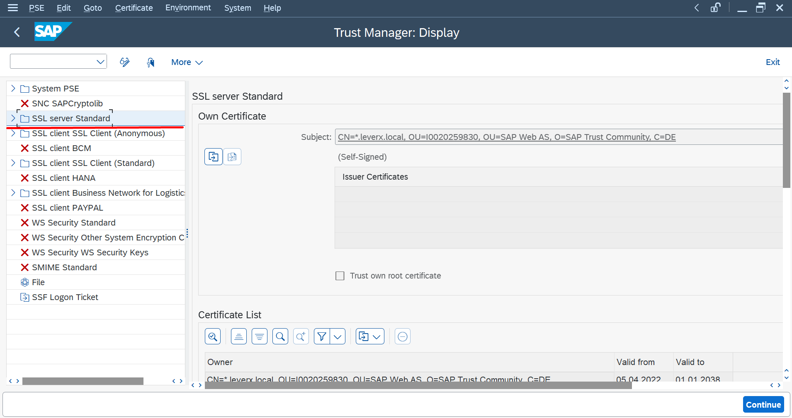
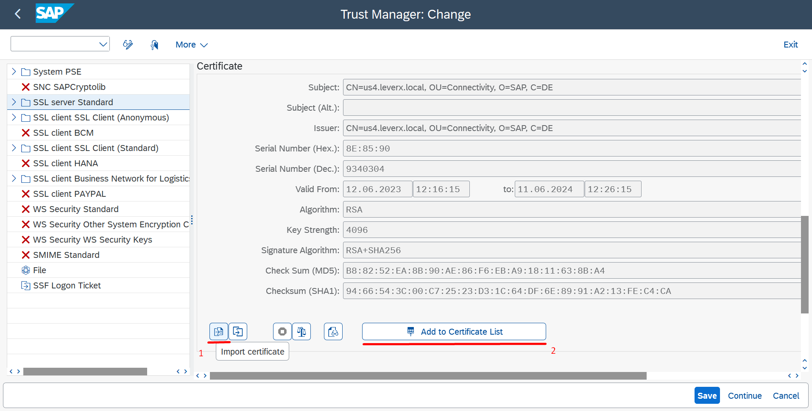
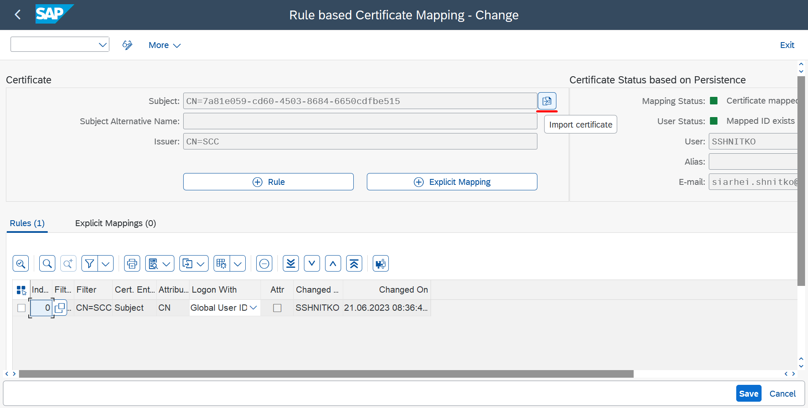
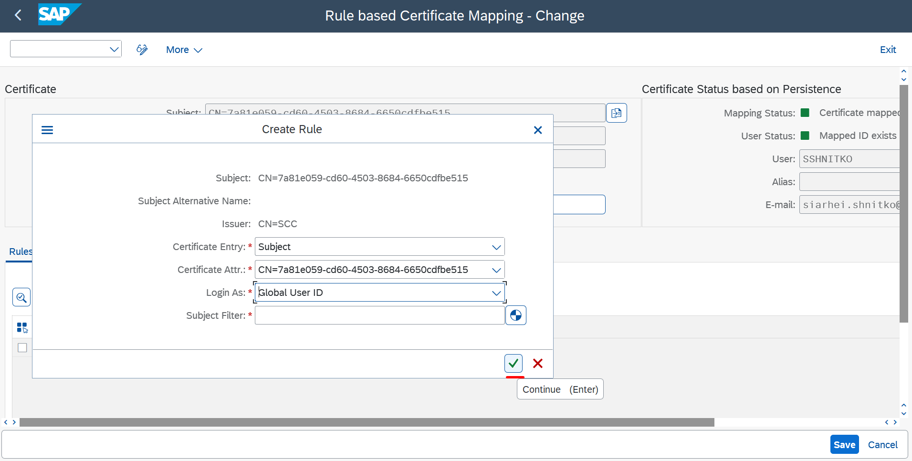
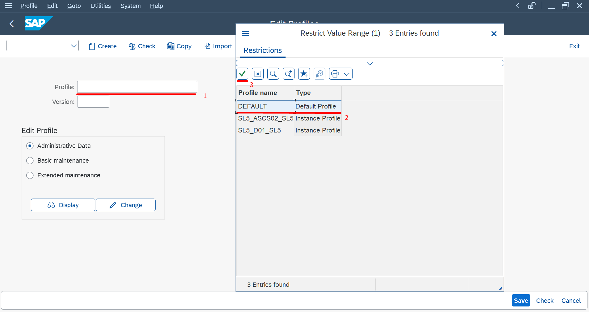
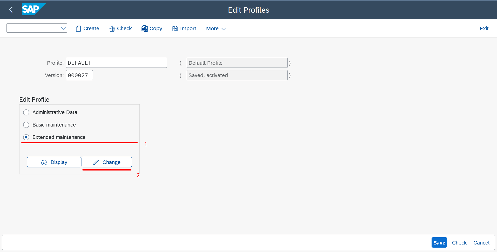
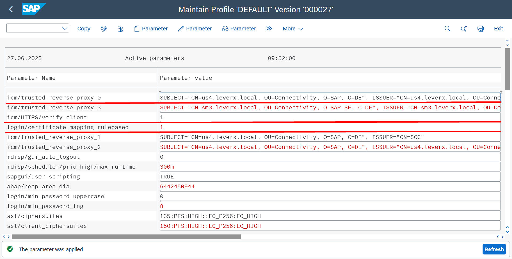
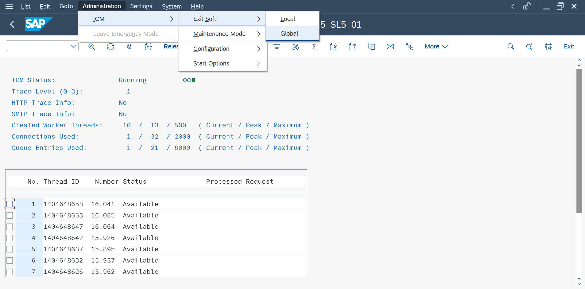

## Details

With this step you will set up trust configuration via uploading all required certificates in order to enable Principal Propagation mechanism

### Step 1: Import System Cetrificate

1. Access your ABAP System

2. Execute **STRUST** transaction
3. Upload System Certificate from your local computer which you created and downloaded within SAP Cloud Connector configuration

- Switch to Change mode

- Select **SSL server Standard**

- Upload the System Cetificate by clicking on **Import certificate** button
- Click **Add to Certificate List** button

- Click **Save** button

As a result, System Certificate from your SAP Cloud Connector has been successfully imported 

### Step 2: Import Sample Certificate

1. Execute **CERTRULE** transaction
2. Upload Sample Certificate from your local computer which you created and downloaded within SAP Cloud Connector configuration

- Switch to Change mode
- Upload the Sample Cetificate by clicking on **Import certificate** button

3. For the imported Certificate create a Rule

- Click **Create Rule** button
- Select proposed Certificate Attribute from the corresponding dropdown
- Select **Global User ID** from Login As dropdown
- Click **Continue** button

As a result, Sample Certificate from your SAP Cloud Connector has been successfully imported as well as required rule to identify a user by using Global User ID field has been created

### Step 3: Configure Profile Parameters

1. Execute **RZ10** transaction
2. Select **Default** profile from the corresponding popup

3. Select **Extended maintanance** in Edit Profile section
4. Click **Change** button

5. Create following parameters by clicking **Create** button

- icm/HTTPS/verify_client - 1
- login/certificate_mapping_rulebased - 1
- icm/trusted_reverse_proxy_0 - 
  - SUBJECT="\<Subject from your system certificate\>",
  - ISSUER="\<Issuer from your system certificate\>"

*Example:* icm/trusted_reverse_proxy_0 - SUBJECT="CN=us4.leverx.local, OU=Connectivity, O=SAP, C=DE", ISSUER="CN=us4.leverx.local, OU=Connectivity, O=SAP, C=DE"

*Note:* In case you have more than one SAP Cloud Connector connected to the same backend system increase the last number of the parameter by 1 for each SAP Cloud Connector (*Example:* icm/trusted_reverse_proxy_1, etc.)

6. Click **Exit** button. Save your changes
7. Click **Save** button

### Step 4: Restart the system

1. Execute **SMICM** transaction
2. On the very top choose Administration -> ICM -> Exit Soft -> Global

3. Click **YES** in the Internet Communication Manager popup
4. On the server your SAP S4HANA On-Premise is run restart the backend system in order to apply all Parameters you've just created

As a result, all required parameters for the DEFAULT profile have been applied

Proceed to the next step: [2 Execute Task Center related activities](https://github.com/Sereg20/Task_Center/blob/master/S4HANA_config/2%20Task%20Center%20Config/README.md)
