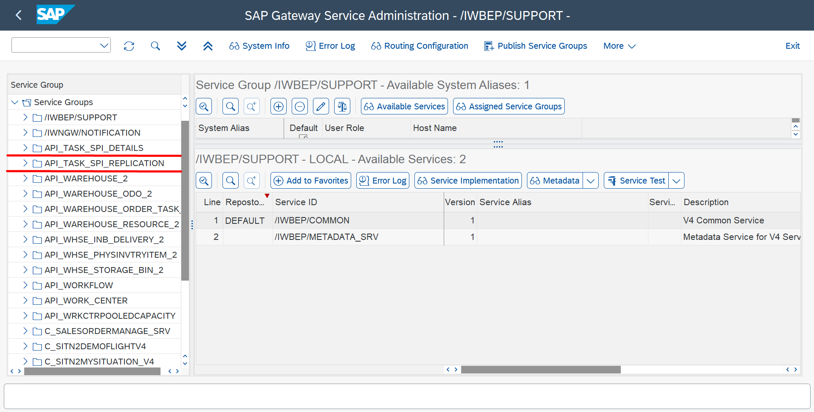

## Details

With this step you will execute all SAP Task Center related activities in the ABAP system

### Step 1: Publish OData V4 Service Groups

1. Access your ABAP System
2. Execute **SPRO** transaction
3. Click **SAP Reference IMG** button
4. Go to SAP Customizing Implementation Guide -> ABAP Platform -> Application Server -> Business Management -> SAP Business Technology Platform Integration -> SAP Task Center Integration
5. Click **IMG - Activity** button for Publish OData V4 Service Group activity

6. In the task bar click **Publish Service Groups** button
7. Choose **LOCAL** as System Alias
8. Fill in Service Group ID field with **API_TASK_SPI_DETAILS** and press Enter then Select Service Group from the table below
9. Fill in Service Group ID field with **API_TASK_SPI_REPLICATION** and press Enter then Select Service Group from the table below
10. Click **Publish Service Groups** button

As a result, both API_TASK_SPI_DETAILS and API_TASK_SPI_REPLICATION service groups are published and displayed in Service Group list

### Step 2: Create Role for Technical User for Task Pull Service

1. Execute **SPRO** transaction
2. Click **SAP Reference IMG** button
3. Go to SAP Customizing Implementation Guide -> ABAP Platform -> Application Server -> Business Management -> SAP Business Technology Platform Integration -> SAP Task Center Integration
4. Click **IMG - Activity** button for Create Role for Technical User for Task Pull Service activity
5. Specify Role name (Z_SAP_TASK_CENTER) and click **Create Single Role** button

6. On the Menu tab, choose **Authorization Default** from the Insert Node menu

7. In the Authorization Default field on the Service popup, select **SAP Gateway OData V4 Backend Service Groups & Assignments**

8. In the TADIR Service field, select the **(G4BA) API_TASK_SPI_REPLICATION** service using the value help then click **Apply** button

 API_TASK_SPI_REPLICATION")

9. Click **Copy** button
10. On the Authorizations tab, click **Expert Mode for Profile Generation**.

 API_TASK_SPI_REPLICATION")

11. Save and generate the role

As a result role Z_SAP_TASK_CENTER for Technical User for Task Pull Service is successfully created

### Step 3: Assign the newly created role to the Service User

1. Execute **SPRO** transaction
2. Click **SAP Reference IMG** button
3. Go to SAP Customizing Implementation Guide -> ABAP Platform -> Application Server -> Business Management -> SAP Business Technology Platform Integration -> SAP Task Center Integration
4. Click **IMG - Activity** button for Create Role for Create Service User for Task Pull Service activity
5. Fill in User field with your Service User name and click **Change** button

6. On the **Roles** tab, assign the role Z_SAP_TASK_CENTER to the Service User 
7. Click **Save** button

As a result, the role for Task Pull Service is assigned to the Service User

### Step 4: Create Role for Task Detail Service

1. Execute **SPRO** transaction
2. Click **SAP Reference IMG** button
3. Go to SAP Customizing Implementation Guide -> ABAP Platform -> Application Server -> Business Management -> SAP Business Technology Platform Integration -> SAP Task Center Integration
4. Click **IMG - Activity** button for Create Role for Task Detail Service activity
5. Specify Role name (Z_SAP_TASK_CENTER_DETAILS) and click **Create Single Role** button
6. On the Menu tab, choose **Authorization Default** from the Insert Node menu
7. In the Authorization Default field on the Service popup, select **SAP Gateway OData V4 Backend Service Groups & Assignments**
8. In the TADIR Service field, select the **(G4BA) API_TASK_SPI_DETAILS** service using the value help then click **Apply** button

 API_TASK_SPI_DETAILS")

9. Click **Copy** button
10. On the Authorizations tab, click **Expert Mode for Profile Generation**.
11. Save and generate the role

As a result role Z_SAP_TASK_CENTER_DETAILS for Business User for Task Detail Service is successfully created

### Step 5: Assign the newly created business role to the Business Users

1. Execute **SPRO** transaction
2. Click **SAP Reference IMG** button
3. Go to SAP Customizing Implementation Guide -> ABAP Platform -> Application Server -> Business Management -> SAP Business Technology Platform Integration -> SAP Task Center Integration
4. Click **IMG - Activity** button for Assign Role for Task Detail Service to Business Users activity
5. Fill in User field with your Business User name and click **Change** button
6. On the **Roles** tab, assign the role Z_SAP_TASK_CENTER_DETAILS to the Business User 
7. Click **Save** button

As a result, the role for Task Detail Service is assigned to the Business User

Proceed to the next step: [Something else](https://)
