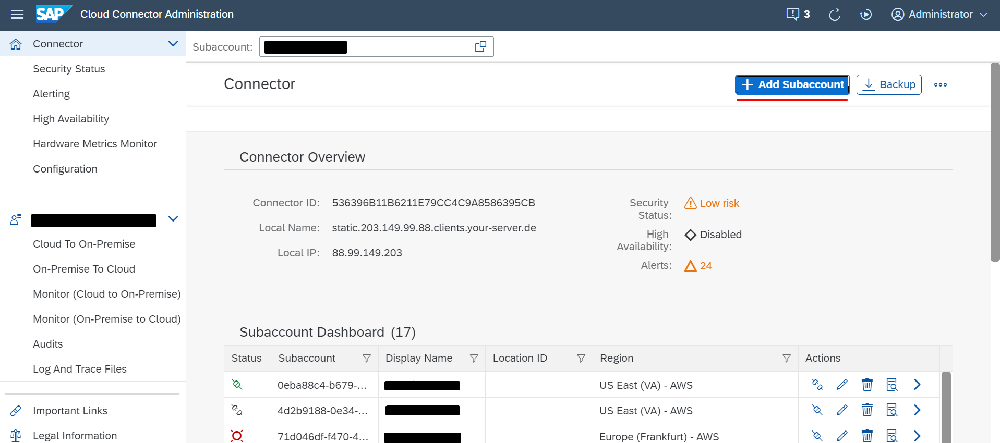
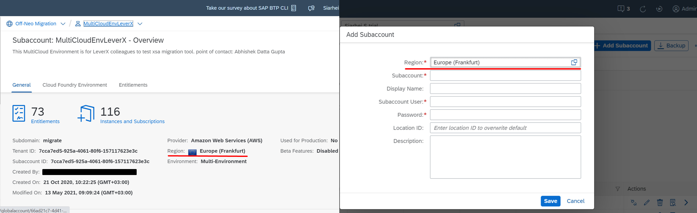
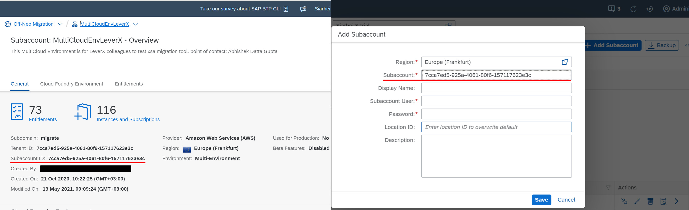
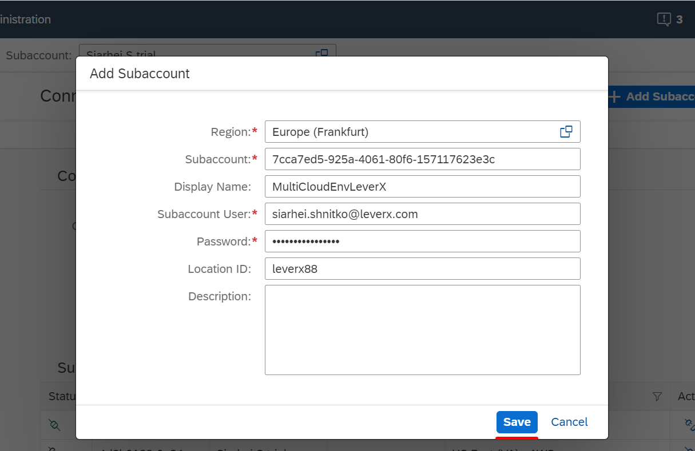
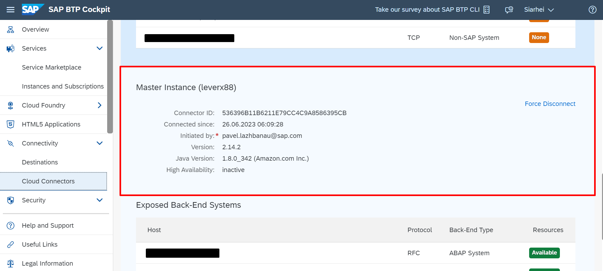

## Details

With this step you will connect SAP Cloud Connector with your BTP Subaccount

### Step 1: Add Subaccount

1. Access you SAP Cloud Connector
2. Add your Subaccount

- From the start page click **Add Subaccount** button

- From Value Help dialog choose **Region** value which corelates with your BTP Subaccount Region

- Fill in **Subaccount** field with your BTP Subaccount ID value

- Provide meaningful **Display Name** 

- Fill in **Subaccount User** field with your BTP Subaccount user's email
- Fill in **Password** field with your BTP Subaccount user's password
- Fill In **Location ID** field with a meaningful value in case you have more than 1 SAP Cloud Connectors connected to the same BTP Subaccount 
- Click **Save** button

As a result, the connection between your BTP Subaccount and SAP Cloud Connector has been established.

### Step 2: Verify the connection is successful

1. Access you SAP BTP Subaccount
2. Go to Cloud Connectors tab and verify it has successfully connected Instance

Proceed to the next step: [2 Mapping with your On-Premise system](https://github.com/Sereg20/Task_Center/blob/master/SCC_config/2%20Mapping/README.md)
