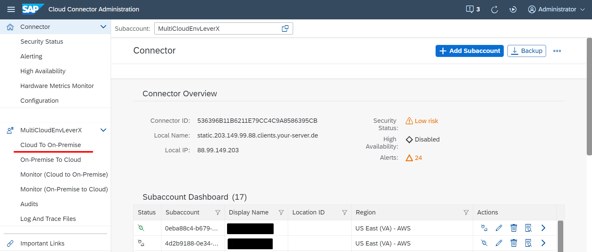
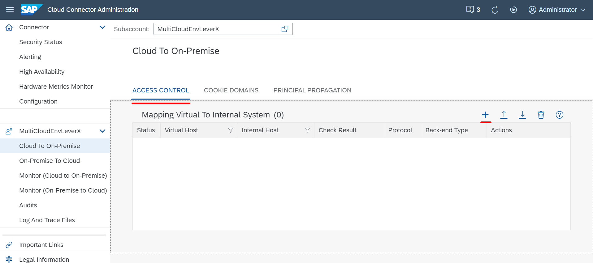
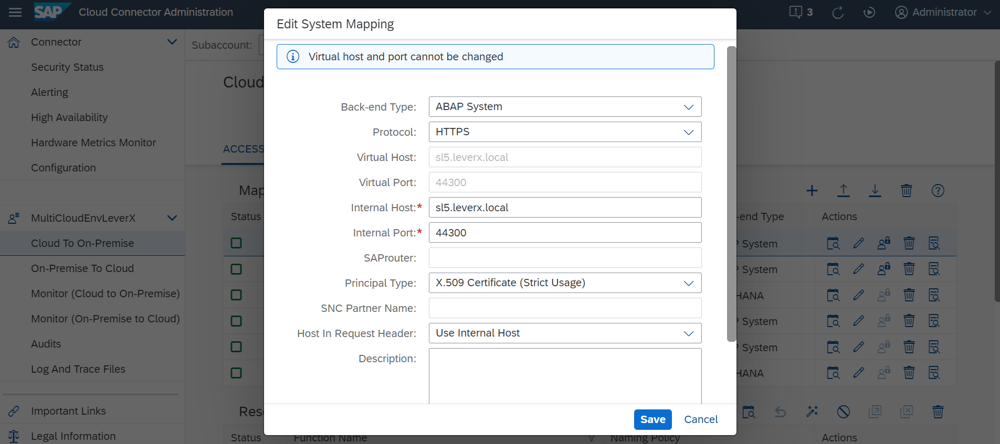
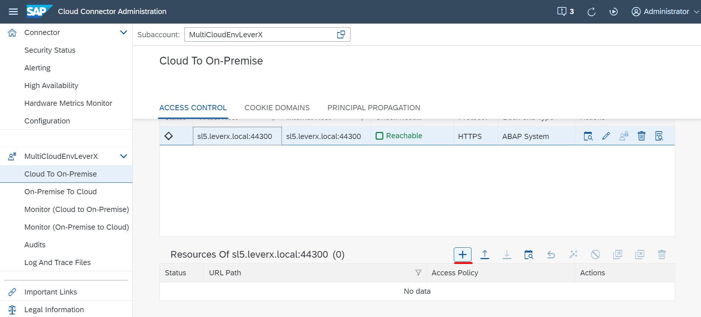
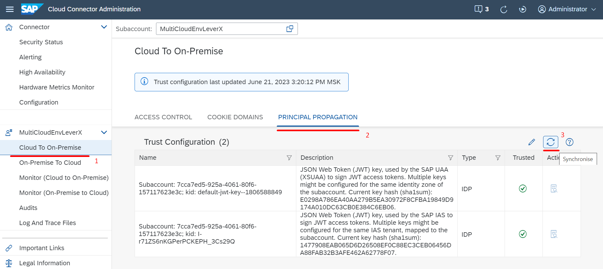

## Details

With this step you will add a mapping to your SAP S4HANA On-Premise system which is essentially a Backend System

### Step 1: Add a Virtual Mapping to your Backend System

1. Access you SAP Cloud Connector. Make sure the newly added subaccount is active in SAP Cloud Connector
2. Under the Subaccount go to **Cloud To On-Premise** tab

3. Add a new mapping by clicking **Add** button Under **Access Control** tab

- Choose **ABAP System** as Back-end Type
- Choose **HTTPS** as Protocol
- Specify your backend system's Internal Host and Internal Port
- Keep Virtual Host** and Virtual Port the same
- Choose **X.509 Certificate (Strict Usage)** as Principal type
- Choose **Use Internal Host** as Host in request Header
- Click **Finish** button 

As a result, mapping to your SAp S4HANA On-Premise system was added

### Step 2: Add required resource to the newly created mapping

1. Choose newly created system from Mapping Virtual To Internal System table
2. Add a resource by clicking **Add** button

- Specify **/sap/opu/odata4/sap/** as URL Path
- Choose **Path And All Sub-Paths** as Access policy
- Click **Save** button

As a result, added resources are allowed to be accessed

### Step 3: Synchronise Trust Configuration

1. Access you SAP Cloud Connector
2. Under the Subaccount go to **Cloud To On-Premise** tab
3. Go to **Principal Propagation** tab
4. Synchronise Trust Configurations by clicking **Synchronise** button

As a result, Principal Propagation is enabled since Trust Configuration between SAP Cloud Connector and your BTP Subaccount is Synchronised

Proceed to the next step: [3 Add required certificates](https://github.com/Sereg20/Task_Center/blob/master/SCC_config/3%20Add%20certificates/README.md)
