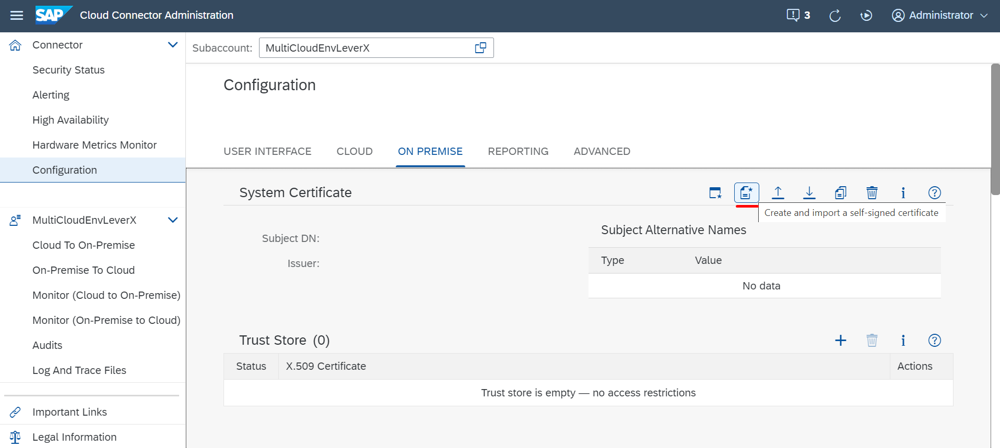
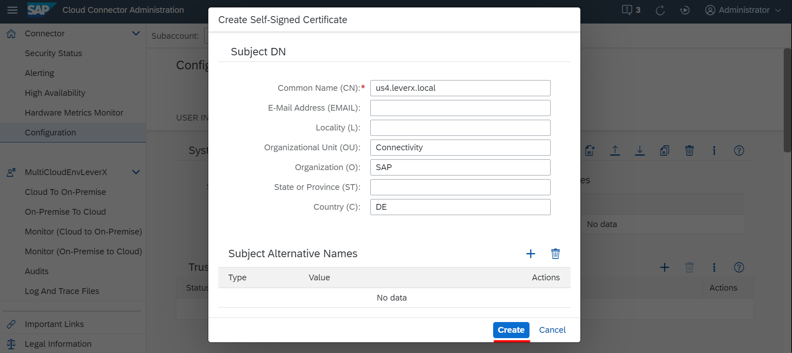
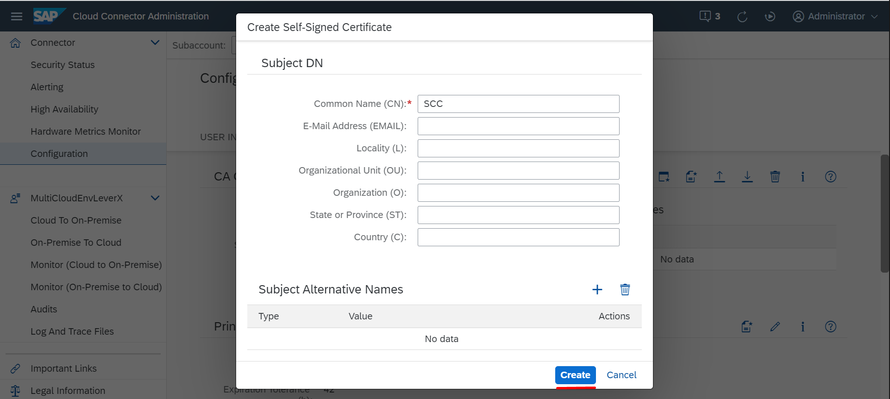
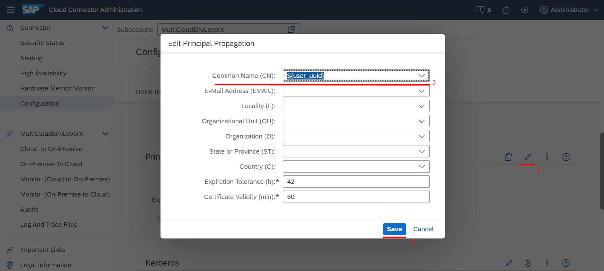
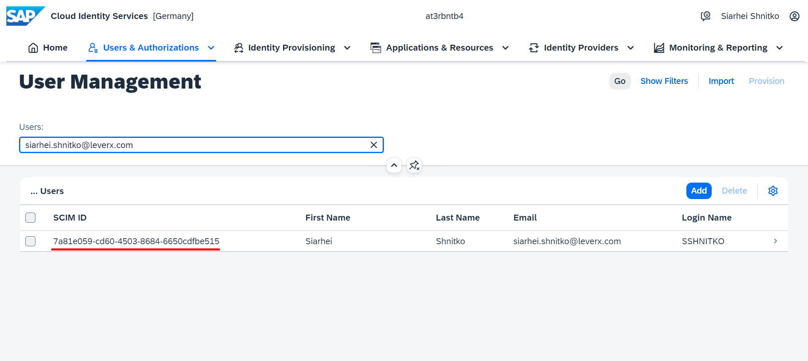

## Details

With this step you will create and download to your local computer all required certificates to establish trust between SAP Cloud Connector and your Backend System.
You will need all these certificates during SAP S4HANA configuration

### Step 1: Create System certificate

1. Access you SAP Cloud Connector
2. Go to **Configuration** tab
3. Go to **On Premise** tab
4. Create System certificate by clicking **Create and import a self-signed certificate** button

- Specify Common Name field with some meaningful value
- (Optional) Specify the rest of fields
- Click **Create** button

5. Download the certificate to your local computer by clicking **Download certificate in DER format** button

As a result, System Certificate is created and downloaded to your local computer

### Step 2: Create CA certificate

1. Create CA certificate by clicking **Create and import a self-signed certificate** button

- Specify Common Name field with some meaningful value
- (Optional) Specify the rest of fields
- Click **Create** button

2. Download the certificate to your local computer by clicking **Download certificate in DER format** button

As a result, CA Certificate is created and downloaded to your local computer

### Step 3: Create Sample certificate

1. Scroll down to the Principal Propagation secntion
2. Set Subject Pattern value as **user_uuid** by clicking **Edit** button 

3. Click **Create a sample certificate** button
4. Enter your user's Global User ID from IAS User Management and click **Generate** button

5. Download the certificate to your local computer

As a result, sample Certificate is created and downloaded to your local computer

Proceed to the next part: [SAP S4HANA On-Premise Configuration](https://github.com/Sereg20/Task_Center/blob/master/S4HANA_config/README.md)
