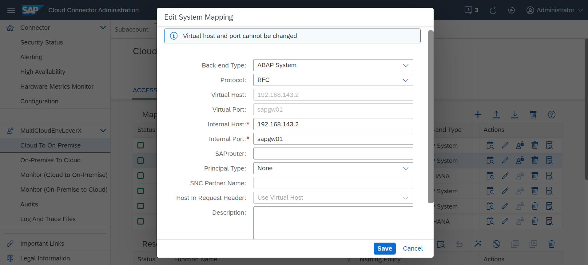
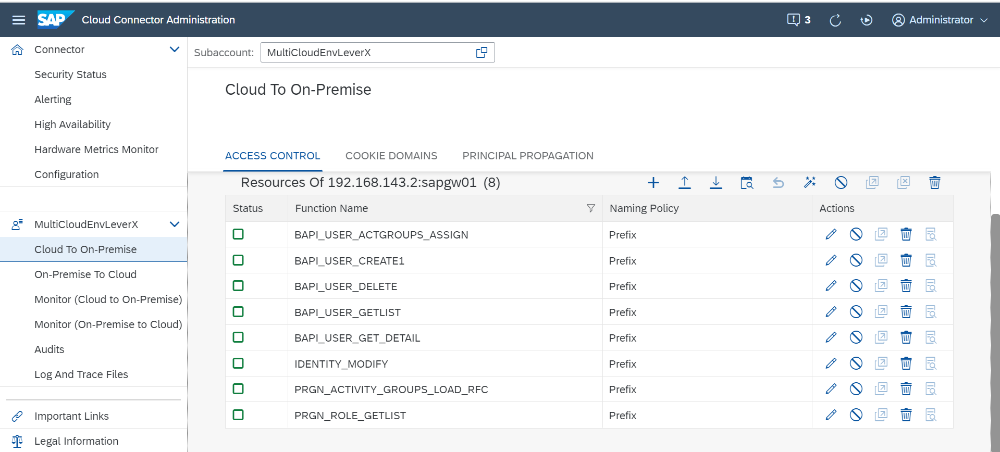

## Details

With this step you will add an RFC mapping to your SAP S4HANA On-Premise system to enable Users data Provisioning

### Step 1: Add a Virtual RFC Mapping to your Backend System

1. Access you SAP Cloud Connector
2. Under the Subaccount go to **Cloud To On-Premise** tab
3. On **Access Control** tab, add a new mapping by clicking **Add** button
- Choose **ABAP System** as Back-end Type
- Choose **RFC** as Protocol
- Select **Without load balancing (application server and instance number)** Connection Type
- Specify your backend system's Application Server and Instance Number
- Keep Virtual Application Server and Virtual Instance Number the same
- Click **Finish** button 

As a result, mapping to your SAP S4HANA On-Premise system has been added

### Step 2: Add required resource to the newly created mapping

1. Choose newly created system from Mapping Virtual To Internal System table
2. Add a resource by clicking **Add** button
3. Specify the following **Prefix** resources

- BAPI_USER_ACTGROUPS_ASSIGN
- BAPI_USER_CREATE1
- BAPI_USER_DELETE
- BAPI_USER_GETLIST
- BAPI_USER_GET_DETAIL
- IDENTITY_MODIFY
- PRGN_ACTIVITY_GROUPS_LOAD_RFC
- PRGN_ROLE_GETLIST

As a result, all required prefixes have been added

Proceed to the next step: [4 Add required certificates](https://github.com/Sereg20/Task_Center/blob/master/SCC_config/3%20Add%20certificates/README.md)
