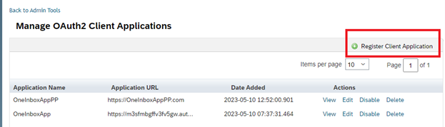
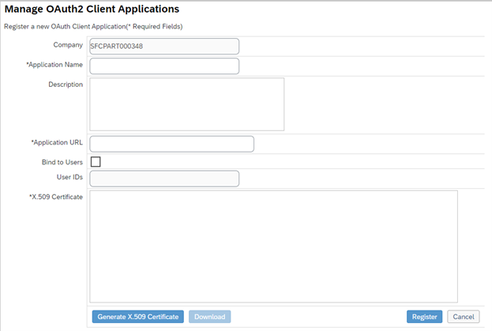
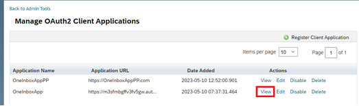
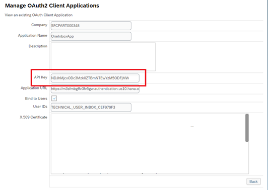
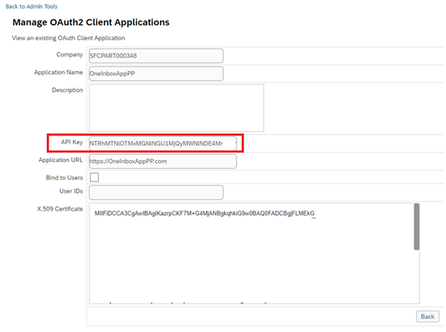

## Details

With this step you will create all required Destinations 

### Step 1: Create the Primary Destination with Technical User

1. Login to SAP SF
2. Navigate to tool **Manage OAuth2 Client Applications**
3. Click **Register Client Application** button

4. Fill in the fields with keys from BTP:

- Application Name - Any Unique value
- Application URL - uaa - url from BTP service key
- Bind to Users - Should be Enabled
- User ID - **TECHNICAL_USER_INBOX_CEF979F3**
- X.509 Certificate - trusted certificate from BTP

5. Click **Register** button
6. After registering, open created oAuth Application by clicking **View**

7. Copy and Save API Key, it will be needed to do BTP configs

As a result, you get API Key of the newly created primary destination

### Step 2: Create the Secondary Destination for the Technical Propagation

1. Login to SAP SF
2. Navigate to tool **Manage OAuth2 Client Applications**
3. Click **Register Client Application** button
4. Fill in the fields:

- Application Name - Any Unique value
- Application URL - uaa - url from BTP service key with /pp postfix
- Bind to Users - Should be Disabled
- User ID - Should be empty
- X.509 Certificate - trusted certificate from BTP

5. Click **Register** button
6. After registering, open created oAuth Application by clicking **View**

7. Copy and Save API Key, it will be needed to do BTP configs

Proceed to the next step: [2 Enabling Push of Task Updates to SAP Task Center](https://github.com/Sereg20/Task_Center/blob/master/SF_config/3%20Enable%20tasks%20push/README.md)
