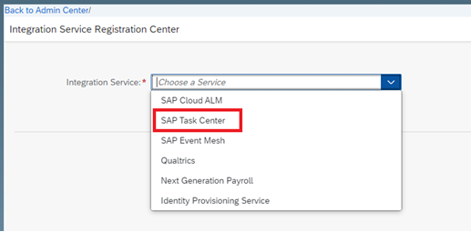
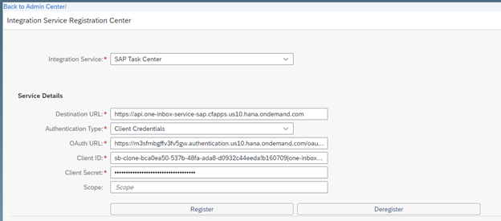

## Details

With this step you will perform all required steps to enable push of Task Updates to SAP Task Center

### Step 1: Enabling Push of Task Updates to SAP Task Center

1. Login to SAP SF
2. Navigate to tool Integration Service Registration Center
3. From the dropdown list choose **SAP Task Center**

4. Fill in the fields:

- Destination URL - endpoints > inbox_rest_url from Service Key. Remove everything after .com
- Authentication Type - **Client Credentials**
- OAuth URL - uaa > url from Service Key. Add **/oauth/token** in the end of the link
- Client ID - uaa > clientid from Service Key
- Client Secret - uaa > clientsecret from Service Key
- Scope -> Leave as is

5. Click **Register** button

As a result, SAP Task Center Integration is configured successfully

Proceed to the next step: [3 Create BTP Destinations](https://)
