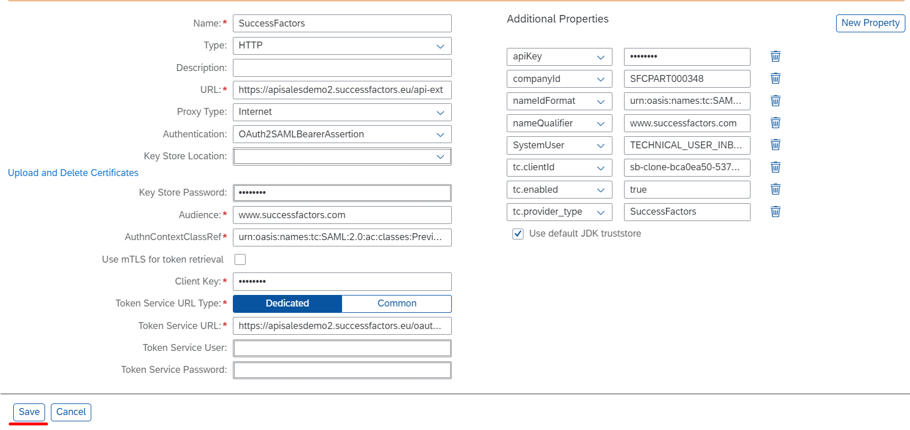
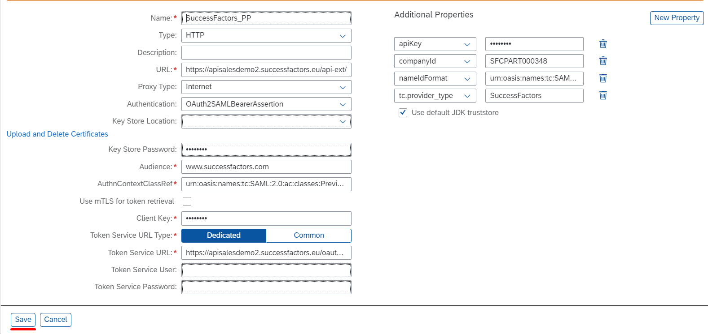

## Details

With this step you will create all required Destinations on BTP to make SAP SuccessFactors tasks provider reachable

### Step 1: Create Primary Destination with the Technical User

1. Access you SAP BTP Subaccount
2. Go to Destinations tab
3. Create Primary Destination

- Click **New Destination** button
- Fill in Name field with value **SuccessFactors**
- Fill in URL field with the URL for your SAP SuccessFactors data center, listed in About HXM Suite OData APIs, and replace the suffix **/odata/v2/** with **/api-ext/**
- Choose **OAuth2SAMLBearerAssertion** from Authentication dropdown
- Fill in Audience field with value **www.successfactors.com**
- Fill in AuthnContextClassRef field with value **urn:oasis:names:tc:SAML:2.0:ac:classes:PreviousSession**
- Fill in Client Key field with the API Key for the technical user you copied during SAP SuccessFactors Configuration
- Fill in Token Service URL field with https://\<SuccessFactorsTenantAPIURL\>/oauth/token *Example:* https://apisalesdemo2.successfactors.eu/oauth/token
- Click **New Property** button
- Add **apiKey** with the API Key for the technical user you copied during SAP SuccessFactors Configuration
- Add **companyId** with value of SuccessFactors Company ID
- Add **nameIdFormat** with value **urn:oasis:names:tc:SAML:1.1:nameid-format:unspecified**
- Add **nameQualifier** with value **www.successfactors.com**
- Add **SystemUser** with value **TECHNICAL_USER_INBOX_CEF979F3**
- Add **tc.clientId** with the value of the uaa clientid from the service key of the service instance you created in previos step 2
- Add **tc.enabled** with value **true**
- Add **tc.provider_type** with value **SuccessFactors**
- Click **Save** button

As a result, the Primary Destination has been created and displayed in Destinations table

### Step 2: Create Secondary Destination for the Principal Propagation

1. Access you SAP BTP Subaccount
2. Go to Destinations tab
3. Create Primary Destination

- Click **New Destination** button
- Fill in Name field with value **SuccessFactors_PP**
- Fill in URL field with the URL for your SAP SuccessFactors data center, listed in About HXM Suite OData APIs, and replace the suffix **/odata/v2/** with **/api-ext/**
- Choose **OAuth2SAMLBearerAssertion** from Authentication dropdown
- Fill in Audience field with value **www.successfactors.com**
- Fill in AuthnContextClassRef field with value **urn:oasis:names:tc:SAML:2.0:ac:classes:PreviousSession**
- Fill in Client Key field with the API Key for principal propagation you copied during SAP SuccessFactors Configuration
- Fill in Token Service URL field with https://\<SuccessFactorsTenantAPIURL\>/oauth/token *Example:* https://apisalesdemo2.successfactors.eu/oauth/token
- Click **New Property** button
- Add **apiKey** with the API Key for principal propagation you copied during SAP SuccessFactors Configuration
- Add **companyId** with value of SuccessFactors Company ID
- Add **nameIdFormat** with value **urn:oasis:names:tc:SAML:1.1:nameid-format:unspecified**
- Add **tc.provider_type** with value **SuccessFactors**
- Click **Save** button

As a result, the Secondary Destination has been created and displayed in Destinations table

Proceed to the next part: [SAP S4HANA Cloud Configuration](https://github.com/Sereg20/Task_Center/blob/master/S4HANA_Cloud_config/README.md)
